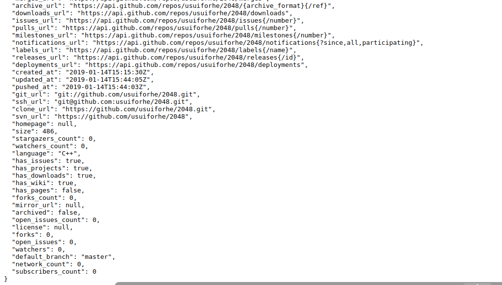
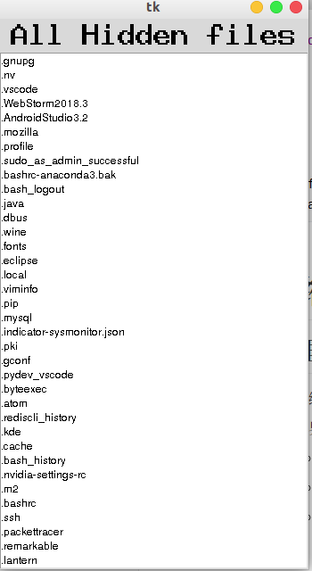
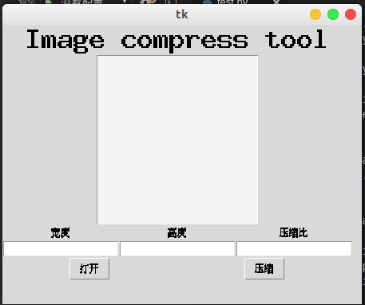
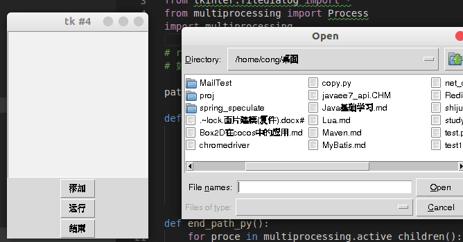

# Github上关注的库，定时检查是否更新


## 原理


- 通过访问 https://api.github.com/repos/usuiforhe/2048 可以知道，github提供了一套API
- 即 "https://api.github.com/repose/" + "用户名" + "/" + "仓库名"
  - 可以查询 仓库发布时间
  - 更新时间
  - 所用语言
  - 仓库大小
  - 等等
- 通过记录上次更新时间，可以与当前更新时间进行对比，如果不同则更新了




- 从图可以看出，返回的是一个json的数据格式
- "updated_at" 即 更新时间


## 代码

```python
import requests
import time
import webbrowser

api_url = 'https://api.github.com/repos/usuiforhe/2048'
visit_url = 'https://github.com/usuiforhe/2048'

last_time = '2019-01-10T15:44:05Z' # 初始化时间

headher = {
    'User-Agent': 'Mozilla/5.0 (X11; Linux x86_64) AppleWebKit/537.36 (KHTML, like Gecko) Chrome/71.0.3578.98 Safari/537.36'
}

while(True):
    data = requests.get(api_url, headers=headher).json() # 请求数据

    new_time = data['updated_at'] # 获取当前时间

    if new_time > last_time:
        last_time = new_time # 更新时间
        webbrowser.open(visit_url) # 之后打开浏览器

    time.sleep(3600) # 休息事件 3600s， 也就是说每一小时请求一次

```


# 展示特意隐藏起来的文件的小工具

## 原理

- 在 linux/mac 系统中，只要文件夹或文件前面带有 '.' 例如 '.text.py' 则代表这是隐藏文件
- 在windows 系统中，不好实现...... 简单方法是将文件夹/文件名前面都加一个一个标识符，表示这个是被隐藏起来的


## 代码

```python
from tkinter import *
import os

app = Tk()# 创建窗口
# btn = Button(text='click me') # 实例化按钮
# btn.pack() # 显示按钮
# app.mainloop() 

label = Label(text='All Hidden files', font=('Hack', 25, 'bold'))# 创建文字标签，内容为all hidden files，字体为font 中的 hack，大小为25，粗体
label.pack()

listbox = Listbox(height=5) # 展示列表
# listbox.insert(END, 'something') # end 代表末尾， 加入 something
# END 是 (0,0) 坐标，tkinter 里面将 END 定义为常量
listbox.pack(fill=BOTH, expand=True) # fill 填充的意思，有 X 填充， Y轴填充，BOTH xy都填充，expand 为true则扩展到整个x或y

def find_files(path):
    files = os.listdir(path)
    for file in files:
        if file.startswith('.'): # linux 和 mac 隐藏文件是以 '.' 开头的
            # print(file)
            listbox.insert(END, file)

find_files('/home/cong')
app.mainloop()
```




# 压缩图片的小工具

## 原理

- 有一个库 PIL 库，可以实现压缩
- 以界面的形式与用户交互
  - 路径由用户决定
  - 压缩大小由用户决定
  - 即变量大都由用户决定
- 用listbox显示路径中选中的图片
- 使用 grid() 方法设置 布局
- PIL有个Image类，而tkinter中也有Image类
  - 因此 要 from PIL import Image as Img 这样就不会冲突了
- tkiner中的珊格布局有几种：pack(), grid() 等
  - 这几种不能混合使用，一个窗口中的布局 仅能使用一个


## 代码


```python
from PIL import Image as Img
from tkinter import *
from tkinter.filedialog import *

path = []

# width 单位像素
# height 单位像素
# opcity 单位百分比 1~100

def save_new_image():
    for file_path in path:
        image = Img.open(file_path) # 打开路径中的图片
        
        if window.children['entry_width'].get() == '': # 如果没有输入目标宽度，则保留宽度
            width = image.size[0]
        else:
            width = int(window.children['entry_width'].get())

        if window.children['entry_height'].get() == '':# 如果没有输入目标高度，则保留高度
            height = image.size[1]
        else:
            height = int(window.children['entry_height'].get())

        if window.children['entry_opcity'].get() == '':# 如果没有输入目标压缩比，则默认不压缩
            opcity = 100
        else :
            opcity = int(window.children['entry_opcity'].get())
        
        image.resize((width, height)).save(file_path+'new.jpg', quality=opcity) # 设置图片宽高 将图片保存到新路径，并压缩 quality的 百分比
    window.children['listbox'].delete(0, END)

def find_path():
    file_Names = askopenfilenames() # 可以框选多个
    lbox = window.children['listbox'] # 获取window的子控件中name为 listbox 的

    global path
    path = file_Names

    for name in file_Names:
        if name.split('/')[-1].endswith('jpg') or name.split('/')[-1].endswith('png') or name.split('/')[-1].endswith('jpeg'): 
            lbox.insert(END, name.split('/')[-1]) # name为一个路径，所以以 '/' 为分隔符，获取文件名
    pass

# def do(){
#   print('1')
# }
# button = Button(text='click, command=do) 后面的参数 command 则是回调函数

def make_window():

    window = Tk()
    # pack() 和 grid() 不能同时使用
    Label(text='Image compress tool', font=('Hack', 25, 'bold')).grid(row=0, rowspan=2, column=0, columnspan=6) # 标题

    Label(window, text='宽度').grid(row=6, column=0, columnspan=2)
    Label(window, text='高度').grid(row=6, column=2, columnspan=2)
    Label(window, text='压缩比').grid(row=6, column=4, columnspan=2)

    Entry(window, name='entry_width').grid(row=7, column=0, columnspan=2) # 宽度输入框
    Entry(window, name='entry_height').grid(row=7, column=2, columnspan=2) # 高度输入框
    Entry(window, name='entry_opcity').grid(row=7, column=4, columnspan=2) # 压缩比

    Listbox(window, name='listbox', bg='#f2f2f2',font=('Hack', 15)).grid(row=2, rowspan=4, column=0, columnspan=6)

    Button(window, text='打开', command=find_path).grid(row=8,rowspan=2, column=0, columnspan=3)
    Button(window, text='压缩', command=save_new_image).grid(row=8,rowspan=2, column=3, columnspan=3)

    window.geometry('450x350') # 窗口大小

    return window

window = make_window()
window.mainloop()
```





# 实时测速网络小工具

## 原理

1. 如何实现检测实时网速

   - 单位时间内电脑得到的数据量的大小
   - 安装 psutil

     - pip install psutil
     - process and system utilities
     - 不仅可以通过一两行代码实现系统监控
     - 还可以跨平台使用，支持Linux／UNIX／OSX／Windows等
     - 是系统管理员和运维小伙伴不可或缺的必备模块
   - psutil.net_io_counters() # 获取网络读写字节／包的个数
     - 获取的是累计数据量，因此需要前一秒减去后一秒，得到这一秒的数据量
     - 电脑有很多网卡，我们只关心其中一个的话，需要加入参数net_io_counters(pernic=True)
       - 返回的是字典类型，比如我们只要 'en0' 这个网络接口的数据，则是net_io_counters(pernic=True)['en0']
   - 不过psutil需要走系统接口，因此需要权限，因此必须sudo 启动


## 代码


```python
import psutil
import time
from tkinter import *

old_time = psutil.net_io_counters(pernic=True)['wlp7s0'].bytes_recv # 记录上次的数据量

def update_bytes():

    new_time = psutil.net_io_counters(pernic=True)['wlp7s0'].bytes_recv # 当前记录量

    global old_time

    result = new_time-old_time 
    old_time = new_time # 更新数据量

    if result > 1024*1024:
        byte.config(text=str(int(result/1024/1024)) + 'MB/s')
    elif result > 1024:
        byte.config(text=str(int(result/1024)) + 'KB/s')
    else:
        byte.config(text=str(result) + 'B/s') # 通过config 更改属性

    byte.after(1000, update_bytes) # 设置一秒后一直函数，则语句每次调用，实现了一秒一次调用

window = Tk()
byte = Label(text='0', font=('Hack', 25, 'bold'))
byte.pack()
byte.after(1000, update_bytes)# 定时器，单位为 毫秒
window.geometry('180x30')
window.mainloop()
```


## 特殊情况

***如果 after 中的函数想要带有形式参数，但规定是不能加上括号***

```python
after(1000, lambda:update_bytes(a))
```


# 能够运行脚本的工具


## 原理

1. 展示有哪些脚本，直接用listbox存储，展示
2. 运行，停止脚本
   - python中有个库runpy 运行py脚本
   - 自己运行自己run_path('copy.py') 运行指定py文件
3.  如果直接执行该函数，会导致自身程序无法正常运行
   - 即 程序按 顺序执行，弹出的新窗口，新窗口是一个无限循环(mainloop) 的程序
   - 导致 自身程序被卡死在 run_path() 这句号
   - 需要用到多进程
   - from multiprocessing import Process
   - 每个进程都要自己的ID即pid


## **`大坑`**

`在网上搜了一下，说是由于两个线程抢占GUI资源导致的，去除其中一个线程中的控件句柄，说白了就是只能有一个线程来画界面。`

- 如果你选中的脚本也是需要绘制图形界面的话，就会出现下面的错误


```python
XIO:  fatal IO error 11 (Resource temporarily unavailable) on X server ":0"
      after 6014 requests (6014 known processed) with 0 events remaining.
[xcb] Unknown sequence number while processing queue
[xcb] Most likely this is a multi-threaded client and XInitThreads has not been called
[xcb] Aborting, sorry about that.
python3: ../../src/xcb_io.c:259: poll_for_event: Assertion `!xcb_xlib_threads_sequence_lost' failed.
已放弃 (核心已转储)
```

- `只能有一个线程来画界面`


## 代码

```python
from runpy import run_path
from tkinter import *
from tkinter.filedialog import *
from multiprocessing import Process
import multiprocessing

# run_path('copy.py') 运行指定py文件
# 如果直接执行该函数，会导致自身程序无法正常运行

path_pys = []

def run_path_py():
    for py in path_pys:
        print(py)
        p = multiprocessing.Process(name='my_process',target = lambda:run_path(py   )) # 创建进程
        # target 应该是个函数，这里不想再新写函数，所以用了lambda表达式
        p.start()
    pass

def end_path_py():
    for proce in multiprocessing.active_children(): # 获取运行进程的列表
        if proce.name == 'my_process':
            proce.terminate()
    window.children['listbox'].delete(0, END)
    pass

def add_path_py():
    file_names = askopenfilenames()
    lbox = window.children['listbox']
    for name in file_names:
        if name.split('/')[-1].endswith('py') and not name.split('/')[-1] in path_pys:
            lbox.insert(END, name.split('/')[-1])
            print(name)
            path_pys.append(name)
    pass

def make_window():
    window = Tk()

    Label(text='运行脚本')

    Listbox(window, name='listbox', bg='#f2f2f2',font=('Hack', 15)).pack()

    Button(window, text='添加', command=add_path_py).pack()
    Button(window, text='运行', command=run_path_py).pack()
    Button(window, text='结束', command=end_path_py).pack()

    return window

window = make_window()
window.mainloop()
```


