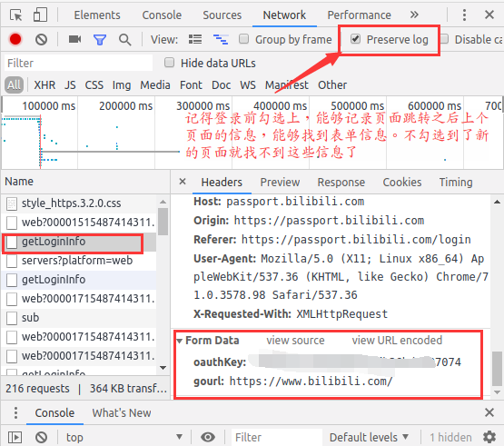
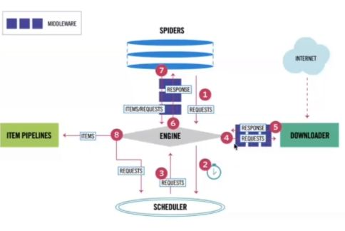

## 爬虫的实际例子：
	1. 搜索引擎（百度、谷歌、360搜索等）。
	2. 伯乐在线。
	3. 惠惠购物助手。
	4. 数据分析与研究（数据冰山知乎专栏）。
	5. 抢票软件等。
## 什么是网络爬虫：

### 通俗理解
	爬虫是一个模拟人类请求网站行为的程序。可以自动请求网页、并数据抓取下来
	然后使用一定的规则提取有价值的数据。
	专业介绍：百度百科。
	通用爬虫和聚焦爬虫：
	
	通用爬虫：通用爬虫是搜索引擎抓取系统（百度、谷歌、搜狗等）的重要组成部分。
			主要是将互联网上的网页下载到本地，形成一个互联网内容的镜像备份。
	聚焦爬虫：是面向特定需求的一种网络爬虫程序,他与通用爬虫的区别在于：
			聚焦爬虫在实施网页抓取的时候会对内容进行筛选和处理，尽量保证只抓取与需求相关的网页信息。


### request和response头中信息

1. Accept:文文本的格式
2.  Accept-Encoding:编码格式
3. Connection:⻓长链接 短链接
4. Cookie:验证用用的
5. Host:域名
6. Referer:标志从哪个⻚页面面跳转过来的
7. User-Agent:浏览器器和用用户的信息

## 为什么用Python写爬虫程序：

	PHP：PHP是世界是最好的语言，但他天生不是做这个的
		而且对多线程、异步支持不是很好，并发处理能力弱。爬虫是工具性程序，对速度和效率要求比较高。
	Java：生态圈很完善，是Python爬虫最大的竞争对手。
		但是Java语言本身很笨重，代码量很大。重构成本比较高，任何修改会导致代码大量改动。爬虫经常要修改采集代码。
	C/C++：运行效率是无敌的。但是学习和开发成本高。写个小爬虫程序可能要大半天时间。
	Python：语法优美、代码简洁、开发效率高、支持的模块多。
		相关的HTTP请求模块和HTML解析模块非常丰富。还有Scrapy和Scrapy-redis框架让我们开发爬虫变得异常简单。
## 准备工具：

	Python3.6开发环境。
	Pycharm 2017 professional版。
	虚拟环境。`virtualenv/virtualenvwrapper`。

## http协议和Chrome抓包工具

### 什么是http和https协议：

	HTTP协议：全称是HyperText Transfer Protocol，中文意思是超文本传输协议，是一种发布和接收HTML页面的方法。服务器端口号是80端口。 
	HTTPS协议：是HTTP协议的加密版本，在HTTP下加入了SSL层。服务器端口号是443端口。

### 在浏览器中发送一个http请求的过程：

	当用户在浏览器的地址栏中输入一个URL并按回车键之后，浏览器会向HTTP服务器发送HTTP请求。HTTP请求主要分为“Get”和“Post”两种方法。
	当我们在浏览器输入URL http://www.baidu.com 的时候，浏览器发送一个Request请求去获取 http://www.baidu.com 的html文件，服务器把Response文件对象发送回给浏览器。
	浏览器分析Response中的 HTML，发现其中引用了很多其他文件，比如Images文件，CSS文件，JS文件。 浏览器会自动再次发送Request去获取图片，CSS文件，或者JS文件。
	当所有的文件都下载成功后，网页会根据HTML语法结构，完整的显示出来了。
### url详解：

	URL是Uniform Resource Locator的简写，统一资源定位符。 一个URL由以下几部分组成：	
	    scheme://host:port/path/?query-string=xxx#anchor
	
	scheme：代表的是访问的协议，一般为http或者https以及ftp等。
	host：主机名，域名，比如www.baidu.com。
	port：端口号。当你访问一个网站的时候，浏览器默认使用80端口。
	path：查找路径。比如：www.jianshu.com/trending/now，后面的trending/now就是path。
	query-string：查询字符串，比如：www.baidu.com/s?wd=python，后面的wd=python就是查询字符串。
	anchor：锚点，后台一般不用管，前端用来做页面定位的。
	在浏览器中请求一个url，浏览器会对这个url进行一个编码。除英文字母，数字和部分符号外，其他的全部使用百分号+十六进制码值进行编码。

### 常用的请求方法：

	在Http协议中，定义了八种请求方法。这里介绍两种常用的请求方法，分别是get请求和post请求。
	
	get请求：一般情况下，只从服务器获取数据下来，并不会对服务器资源产生任何影响的时候会使用get请求。
	post请求：向服务器发送数据（登录）、上传文件等，会对服务器资源产生影响的时候会使用post请求。 
	以上是在网站开发中常用的两种方法。
	并且一般情况下都会遵循使用的原则。但是有的网站和服务器为了做反爬虫机制，也经常会不按常理出牌，

有可能一个应该使用get方法的请求就一定要改成post请求，这个要视情况而定。
### 请求头常见参数：

	在http协议中，向服务器发送一个请求，数据分为三部分，第一个是把数据放在url中，第二个是把数据放在body中（在post请求中），第三个就是把数据放在head中。
	
	这里介绍在网络爬虫中经常会用到的一些请求头参数：
	
	User-Agent：浏览器名称。这个在网络爬虫中经常会被使用到。请求一个网页的时候，服务器通过这个参数就可以知道这个请求是由哪种浏览器发送的。
			如果我们是通过爬虫发送请求，那么我们的User-Agent就是Python，这对于那些有反爬虫机制的网站来说，可以轻易的判断你这个请求是爬虫。
			因此我们要经常设置这个值为一些浏览器的值，来伪装我们的爬虫。
	Referer：表明当前这个请求是从哪个url过来的。这个一般也可以用来做反爬虫技术。如果不是从指定页面过来的，那么就不做相关的响应。
	Cookie：http协议是无状态的。也就是同一个人发送了两次请求，服务器没有能力知道这两个请求是否来自同一个人。因此这时候就用cookie来做标识。
			一般如果想要做登录后才能访问的网站，那么就需要发送cookie信息了。

### 常见响应状态码：

	200：请求正常，服务器正常的返回数据。
	301：永久重定向。比如在访问www.jingdong.com的时候会重定向到www.jd.com。
	302：临时重定向。比如在访问一个需要登录的页面的时候，而此时没有登录，那么就会重定向到登录页面。
	400：请求的url在服务器上找不到。换句话说就是请求url错误。
	403：服务器拒绝访问，权限不够。
	500：服务器内部错误。可能是服务器出现bug了。
	Chrome抓包工具：

### Chrome浏览器
	Chrome浏览器是一个非常亲近开发者的浏览器。可以方便的查看网络请求以及发送的参数。
	对着网页右键->检查。然后就可以打开开发者选项。以下用图片来说明。 


## urllib库

	urllib库是Python中一个最基本的网络请求库。可以模拟浏览器的行为，向指定的服务器发送一个请求，并可以保存服务器返回的数据。

### urlopen函数：

	在Python3的urllib库中，所有和网络请求相关的方法，都被集到urllib.request模块下面了，以先来看下urlopen函数基本的使用：
	
	from urllib import request
	resp = request.urlopen('http://www.baidu.com')
	print(resp.read())
	
	实际上，使用浏览器访问百度，右键查看源代码。你会发现，跟我们刚才打印出来的数据是一模一样的。
	也就是说，上面的三行代码就已经帮我们把百度的首页的全部代码爬下来了。一个基本的url请求对应的python代码真的非常简单。

#### 以下对urlopen函数的进行详细讲解：

	url：请求的url。
	data：请求的data，如果设置了这个值，那么将变成post请求。
	返回值：返回值是一个http.client.HTTPResponse对象，这个对象是一个类文件句柄对象。有read(size)、readline、readlines以及getcode等方法。

### urlretrieve函数：

```python
这个函数可以方便的将网页上的一个文件保存到本地。以下代码可以非常方便的将百度的首页下载到本地：

from urllib import request
request.urlretrieve('http://www.baidu.com/','baidu.html')
```
### urlencode函数：

```python
用浏览器发送请求的时候，如果url中包含了中文或者其他特殊字符，那么浏览器会自动的给我们进行编码。
而如果使用代码发送请求，那么就必须手动的进行编码，这时候就应该使用urlencode函数来实现。urlencode可以把字典数据转换为URL编码的数据。
示例代码如下：

from urllib import parse
data = {'name':'爬虫基础','greet':'hello world','age':100}
qs = parse.urlencode(data)
print(qs)
```

### parse_qs函数：

```python
可以将经过编码后的url参数进行解码。示例代码如下：

from urllib import parse
qs = "name=%E7%88%AC%E8%99%AB%E5%9F%BA%E7%A1%80&greet=hello+world&age=100"
print(parse.parse_qs(qs))
urlparse和urlsplit：

有时候拿到一个url，想要对这个url中的各个组成部分进行分割，那么这时候就可以使用urlparse或者是urlsplit来进行分割。示例代码如下：

from urllib import request,parse

url = 'http://www.baidu.com/s?username=zhiliao'

result = parse.urlsplit(url)
# result = parse.urlparse(url)

print('scheme:',result.scheme)
print('netloc:',result.netloc)
print('path:',result.path)
print('query:',result.query)
```

### urlparse和urlsplit
	urlparse和urlsplit基本上是一模一样的。唯一不一样的地方是，urlparse里面多了一个params属性，而urlsplit没有这个params属性。
	比如有一个url为：url = 'http://www.baidu.com/s;hello?wd=python&username=abc#1'，
	那么urlparse可以获取到hello，而urlsplit不可以获取到。url中的params也用得比较少。


### urllib库请求

#### get
1. 汉字报错 :解释器器ascii没有汉字 url汉字转码
   urllib.parse.quote safe="string.printtable"
2. 字典传参
   urllib.parse.urlencode()

#### post:
1. urlib.request.openurl(url,data = "服务器器接受的数据")
2. handler:处理理器器的自自定义:

#### User-Agent:

`在浏览网页的时候，爬虫的浏览速度明显超过人的点击速度，所以速度过快会触发反扒。`

这个时候，我们可以通过自定义`User-Agent`，模拟出不同的用户在浏览网页，在一定机制上可以防止反扒机制

1. 模拟真实的浏览器器发送请求:
   1. 百度批量量搜索
   2. 检查元素(百度搜索useragent大大全)
2. request.add_header(动态添加head数据)
3. 响应头 response.header
4. 创建request:urlib.request.Request(url)

#### IP代理理:
1. 免费的IP:时效性差,错误率高高
2. 付费的IP:贵花钱,也有失效不不能用用的

##### IP分类:
1. 透明:对方方知道我们真实的ip
2. 匿名:对方方不不知道我们真实的ip,知道了了你使用用了了代理理
3. 高匿:对方方不不知道我们真实的IP.也不不知道我们使用用了了代理理

#### handler:

系统的urlopen()不不支支持代理理的添加
创建对应的处理器(handler)

1. 代理理处理理器器:ProxyHandler
2. 拿着ProxyHandler创建opener:bulid_opener()
3. opener.open(url)就可以请求数据
4. auth认证handler
   CookieshandlerURLError
   requests(第三方方模块):简单易易用用
   数据解析:
   数据存储:json csv MongDB resdis mysql


### urllib库实战

#### 使用百度搜索信息，返回查询的网页

```python
import urllib.parse
import string
import urlllib

def getHttp(url):
    baidu_url = 'http://www.baidu.com/s?wd='
    fin_url = baidu_url + url
    # 由于用户输入的信息可能是中文，所以需要转码为ASCII码等python可以解释的编码
    fin_code_url = urllib.parse.quote(fin_url, safe=string.printable)
    r = urllib.request.urlopen(fin_code_url)
    # r.read() 可能返回的是bytes数据，而不是字符串数据，因此存储为utf-8需要decode一下
    with open('baidu.html', 'w', encoding='utf-8') as f:
        f.write(r.read().decode())

url = input()
# url 存储输入的信息，代表用户想要查询的数据
getHttp(url)
```


#### get请求

```python
def get_params():
    baidu_url = 'http://www.baidu.com/s?'
    # 如果发送get请求，那么请求参数就在请求链接中，通过字典的方式来设置请求参数
    diction = {
        "wd":"中文",
        "key":"zhang",
        "value":"san"
    }
    # 把字典转换为字符串，然后用于字符串拼接，同时可以把中文转换为ASCII便于Python解释
    str_params = urllib.parse.urlencode(diction);
    fin_url = baidu_url+str_params
    r = urllib.request.urlopen(fin_url)
    with open('index.html', 'w', encoding='utf-8') as f:
        f.write(r.read().decode())

```


#### 添加响应头信息

```http
常见的User-Agent：
Opera
Mozilla/5.0 (Windows NT 6.1; WOW64) AppleWebKit/537.36 (KHTML, like Gecko) Chrome/39.0.2171.95 Safari/537.36 OPR/26.0.1656.60
Opera/8.0 (Windows NT 5.1; U; en)
Mozilla/5.0 (Windows NT 5.1; U; en; rv:1.8.1) Gecko/20061208 Firefox/2.0.0 Opera 9.50
Mozilla/4.0 (compatible; MSIE 6.0; Windows NT 5.1; en) Opera 9.50
 
Firefox
Mozilla/5.0 (Windows NT 6.1; WOW64; rv:34.0) Gecko/20100101 Firefox/34.0
Mozilla/5.0 (X11; U; Linux x86_64; zh-CN; rv:1.9.2.10) Gecko/20100922 Ubuntu/10.10 (maverick) Firefox/3.6.10
 
Safari
Mozilla/5.0 (Windows NT 6.1; WOW64) AppleWebKit/534.57.2 (KHTML, like Gecko) Version/5.1.7 Safari/534.57.2
 
chrome
Mozilla/5.0 (Windows NT 6.1; WOW64) AppleWebKit/537.36 (KHTML, like Gecko) Chrome/39.0.2171.71 Safari/537.36
Mozilla/5.0 (X11; Linux x86_64) AppleWebKit/537.11 (KHTML, like Gecko) Chrome/23.0.1271.64 Safari/537.11
Mozilla/5.0 (Windows; U; Windows NT 6.1; en-US) AppleWebKit/534.16 (KHTML, like Gecko) Chrome/10.0.648.133 Safari/534.16
 
360
Mozilla/5.0 (Windows NT 6.1; WOW64) AppleWebKit/537.36 (KHTML, like Gecko) Chrome/30.0.1599.101 Safari/537.36
Mozilla/5.0 (Windows NT 6.1; WOW64; Trident/7.0; rv:11.0) like Gecko
 
 
淘宝浏览器
Mozilla/5.0 (Windows NT 6.1; WOW64) AppleWebKit/536.11 (KHTML, like Gecko) Chrome/20.0.1132.11 TaoBrowser/2.0 Safari/536.11
 
猎豹浏览器
Mozilla/5.0 (Windows NT 6.1; WOW64) AppleWebKit/537.1 (KHTML, like Gecko) Chrome/21.0.1180.71 Safari/537.1 LBBROWSER
Mozilla/5.0 (compatible; MSIE 9.0; Windows NT 6.1; WOW64; Trident/5.0; SLCC2; .NET CLR 2.0.50727; .NET CLR 3.5.30729; .NET CLR 3.0.30729; Media Center PC 6.0; .NET4.0C; .NET4.0E; LBBROWSER) 
Mozilla/4.0 (compatible; MSIE 6.0; Windows NT 5.1; SV1; QQDownload 732; .NET4.0C; .NET4.0E; LBBROWSER)"
QQ浏览器
Mozilla/5.0 (compatible; MSIE 9.0; Windows NT 6.1; WOW64; Trident/5.0; SLCC2; .NET CLR 2.0.50727; .NET CLR 3.5.30729; .NET CLR 3.0.30729; Media Center PC 6.0; .NET4.0C; .NET4.0E; QQBrowser/7.0.3698.400)
Mozilla/4.0 (compatible; MSIE 6.0; Windows NT 5.1; SV1; QQDownload 732; .NET4.0C; .NET4.0E)
sogou浏览器
Mozilla/5.0 (Windows NT 5.1) AppleWebKit/535.11 (KHTML, like Gecko) Chrome/17.0.963.84 Safari/535.11 SE 2.X MetaSr 1.0
Mozilla/4.0 (compatible; MSIE 7.0; Windows NT 5.1; Trident/4.0; SV1; QQDownload 732; .NET4.0C; .NET4.0E; SE 2.X MetaSr 1.0)
maxthon浏览器
Mozilla/5.0 (Windows NT 6.1; WOW64) AppleWebKit/537.36 (KHTML, like Gecko) Maxthon/4.4.3.4000 Chrome/30.0.1599.101 Safari/537.36
UC浏览器
Mozilla/5.0 (Windows NT 6.1; WOW64) AppleWebKit/537.36 (KHTML, like Gecko) Chrome/38.0.2125.122 UBrowser/4.0.3214.0 Safari/537.36


IPhone
Mozilla/5.0 (iPhone; U; CPU iPhone OS 4_3_3 like Mac OS X; en-us) AppleWebKit/533.17.9 (KHTML, like Gecko) Version/5.0.2 Mobile/8J2 Safari/6533.18.5
 
IPod
Mozilla/5.0 (iPod; U; CPU iPhone OS 4_3_3 like Mac OS X; en-us) AppleWebKit/533.17.9 (KHTML, like Gecko) Version/5.0.2 Mobile/8J2 Safari/6533.18.5
 
IPAD
Mozilla/5.0 (iPad; U; CPU OS 4_2_1 like Mac OS X; zh-cn) AppleWebKit/533.17.9 (KHTML, like Gecko) Version/5.0.2 Mobile/8C148 Safari/6533.18.5
Mozilla/5.0 (iPad; U; CPU OS 4_3_3 like Mac OS X; en-us) AppleWebKit/533.17.9 (KHTML, like Gecko) Version/5.0.2 Mobile/8J2 Safari/6533.18.5
 
Android
Mozilla/5.0 (Linux; U; Android 2.2.1; zh-cn; HTC_Wildfire_A3333 Build/FRG83D) AppleWebKit/533.1 (KHTML, like Gecko) Version/4.0 Mobile Safari/533.1
Mozilla/5.0 (Linux; U; Android 2.3.7; en-us; Nexus One Build/FRF91) AppleWebKit/533.1 (KHTML, like Gecko) Version/4.0 Mobile Safari/533.1
 
QQ浏览器 Android版本
MQQBrowser/26 Mozilla/5.0 (Linux; U; Android 2.3.7; zh-cn; MB200 Build/GRJ22; CyanogenMod-7) AppleWebKit/533.1 (KHTML, like Gecko) Version/4.0 Mobile Safari/533.1
 
Android Opera Mobile
Opera/9.80 (Android 2.3.4; Linux; Opera Mobi/build-1107180945; U; en-GB) Presto/2.8.149 Version/11.10
 
Android Pad Moto Xoom
Mozilla/5.0 (Linux; U; Android 3.0; en-us; Xoom Build/HRI39) AppleWebKit/534.13 (KHTML, like Gecko) Version/4.0 Safari/534.13
 
BlackBerry
Mozilla/5.0 (BlackBerry; U; BlackBerry 9800; en) AppleWebKit/534.1+ (KHTML, like Gecko) Version/6.0.0.337 Mobile Safari/534.1+
 
WebOS HP Touchpad
Mozilla/5.0 (hp-tablet; Linux; hpwOS/3.0.0; U; en-US) AppleWebKit/534.6 (KHTML, like Gecko) wOSBrowser/233.70 Safari/534.6 TouchPad/1.0
 
Nokia N97
Mozilla/5.0 (SymbianOS/9.4; Series60/5.0 NokiaN97-1/20.0.019; Profile/MIDP-2.1 Configuration/CLDC-1.1) AppleWebKit/525 (KHTML, like Gecko) BrowserNG/7.1.18124
 
Windows Phone Mango
Mozilla/5.0 (compatible; MSIE 9.0; Windows Phone OS 7.5; Trident/5.0; IEMobile/9.0; HTC; Titan)
 
UC浏览器
UCWEB7.0.2.37/28/999
 
NOKIA5700/ UCWEB7.0.2.37/28/999
 
UCOpenwave
Openwave/ UCWEB7.0.2.37/28/999
 
UC Opera
Mozilla/4.0 (compatible; MSIE 6.0; ) Opera/UCWEB7.0.2.37/28/999

```


```python
def load_baidu():
    url = "https://www.baidu.com/s?"
    header = {
        "User-Agent":"Mozilla/5.0 (X11; Linux x86_64) AppleWebKit/537.36 (KHTML, like Gecko) Chrome/71.0.3578.98 Safari/537.36",

    }
    
    #创建请求对象
    request = urllib.request.Request(url)
    
    #获取请求头的信息，因为没有设置值，所以为空
    print(request.headers)

    # 添加请求头信息
    #方法1
    request = urllib.request.Request(url, headers=header)
    #方法2 动态添加，通过创建user-agent来随机的创建出请求头，以迷惑服务器的反扒机制
    request.add_header("User-Agent","Mozilla/5.0 (X11; Linux x86_64) AppleWebKit/537.36 (KHTML, like Gecko) Chrome/71.0.3578.98 Safari/537.36");

    #response = urllib.request.urlopen(url) 也可以，但是我们可以通过这是请求对象的方式来设置一下请求参数
    respon = urllib.request.urlopen(request)

    #查看响应头
    print(respon.headers)

    with open("index.html", 'w',  encoding='utf-8') as f:
        f.write(respon.read().decode())

```


#### urllib中的proxy代理

```python
def handler_openner():
    url = "https://www.baidu.com"
    #handler 处理器
    #系统的urlopen 并没有添加 代理的功能
    # handler = urllib.request.HTTPHandler()#创建处理器
    #添加代理
    proxy = {
            #免费代理的写法
            "http":"http://121.61.1.129:9999"
            #付费代理的写法
            #"http":"用户名":密码
    }
    #可以使用list来设置随机代理，防止反扒
    proxys = [
        {"http","1.192.240.196:9999"},
        {"http","125.123.141.52:9999"},
        {"http","119.101.125.128:9999"},
        {"http","119.101.127.46:9999"},
        {"http","121.61.3.143:9999"}
    ]
    # 代理的处理器
    proxy_handler = urllib.request.ProxyHandler(proxy)
    # opener = urllib.request.build_opener(handler)#通过处理器创建自己的opener
    opener = urllib.request.build_opener(proxy_handler)#通过代理器创建自己的opener
    #通过查看 urllib.request.urlopen()函数可以发现，python网络连接就是通过opener的open函数
    #通过有代理的opener来执行网络连接
    data = opener.open(url).read();
    print(data)
```


#### urllib中使用cookie的两种方式




```python
import urllib.parse
import urllib.request
from http import cookiejar

def use_cookie():
    # 使用cookie的第一种方法，直接从浏览器中复制粘贴已有的cookie
    headers1 = {
        "User-Agent":"Mozilla/5.0 (X11; Linux x86_64) AppleWebKit/537.36 (KHTML, like Gecko) Chrome/71.0.3578.98 Safari/537.36",
        "Cookie":"BAIDUID=670AE50017189CEE98CF4241E77CF222:FG=1; BIDUPSID=670AE50012; PSTM=1542866664; BDUSS=GJ2d0NyU2FxSzUxT1B-Njdzc0puOWVjbVFqWHFwMHBKbWZuanpqRHRIYlB6RDVjQVFBQUFBJCQAAAAAAAAAAAEAAADZlxkqc21hbGy~wsTPv9gAAAAAAAAAAAM8~F1zPPxdcU; BDORZ=B490B5EBF6F3CD402E515D22BCDA1598; H_PS_PSSID=1433_21126_18560_28329_26350_28414_27543"
    }
    url = "https://www.baidu.com"
    request = urllib.request.Request(url, headers=headers1)#将url和header导入到request对象中
    #request.add_header("User-Agent","Mozilla/5.0 (X11; Linux x86_64) AppleWebKit/537.36 (KHTML, like Gecko) Chrome/71.0.3578.98 Safari/537.36") 或者随后动态导入header
    respon = urllib.request.urlopen(request)
    data = respon.read().decode('utf-8')
    print(data)

def save_cookie():
    # 第二种方法，利用登录界面存储cookie
    cookies = cookiejar.CookieJar()
    login_url = "https://passport.bilibili.com/login"
    headers2 = {
        "User-Agent":"Mozilla/5.0 (X11; Linux x86_64) AppleWebKit/537.36 (KHTML, like Gecko) Chrome/71.0.3578.98 Safari/537.36"
    }#这里用代码实现存储cookie，所以头里面不需要cookie
    #从 浏览器中 可以知道 登录是POST 请求，同时在浏览器工具中可以发现 名为“Form Data”的项目
    form_data_nodecode = {
        # 获取登录信息，首先你要自己先登录一次，这样才能找到登录时应该发送哪些信息
        "oauthKey": "f58e34d07074",
        "gourl": "https://www.bilibili.com/"
        #是通过浏览器 检查 找到的 表单信息
    }# 千万注意 把form_data转换一下，因为不能发送字典请求，需要转换为字符串，再转换成bytes，因为post请求只接受bytes
    form_data = urllib.parse.urlencode(form_data_nodecode).encode('utf-8')

    # 可以通过查找规律，找到form_data的信息规律
    # 定义又添加cookie功能的处理器
    cookie_handler = urllib.request.HTTPCookieProcessor(cookies)
    #根据处理器生成opener
    opener = urllib.request.build_opener(cookie_handler)
    # 生成request对象，设置请求头和链接
    login_request = urllib.request.Request(login_url, headers=headers2, data=form_data)
    #发送请求，登录成功则会 把cookie保存到 cookiejar中
    opener.open(login_request)

    #访问个人中心
    url = "https://account.bilibili.com/account/face/upload"
    person_request = urllib.request.Request(url, headers=headers2)
    respons = opener.open(person_request)
    # bytes->str
    data = respons.read().decode('utf-8')
    print(data)
```


### request.Request类：

```python
如果想要在请求的时候增加一些请求头，那么就必须使用request.Request类来实现。比如要增加一个User-Agent，示例代码如下：

from urllib import request

headers = {
'User-Agent': 'Mozilla/5.0 (Windows NT 10.0; Win64; x64) AppleWebKit/537.36 (KHTML, like Gecko) Chrome/62.0.3202.94 Safari/537.36'
}
req = request.Request("http://www.baidu.com/",headers=headers)
resp = request.urlopen(req)
print(resp.read())
```


## ProxyHandler处理器（代理设置）

```python
很多网站会检测某一段时间某个IP的访问次数(通过流量统计，系统日志等)，如果访问次数多的不像正常人，它会禁止这个IP的访问。
所以我们可以设置一些代理服务器，每隔一段时间换一个代理，就算IP被禁止，依然可以换个IP继续爬取。
urllib中通过ProxyHandler来设置使用代理服务器，下面代码说明如何使用自定义opener来使用代理：

from urllib import request
# 这个是没有使用代理的
# resp = request.urlopen('http://httpbin.org/get')
# print(resp.read().decode("utf-8"))

# 这个是使用了代理的
handler = request.ProxyHandler({"http":"218.66.161.88:31769"})

opener = request.build_opener(handler)
req = request.Request("http://httpbin.org/ip")
resp = opener.open(req)
print(resp.read())
```

### 常用的代理有：

	西刺免费代理IP：http://www.xicidaili.com/
	快代理：http://www.kuaidaili.com/
	代理云：http://www.dailiyun.com/

## 什么是cookie：

	在网站中，http请求是无状态的。也就是说即使第一次和服务器连接后并且登录成功后，第二次请求服务器依然不能知道当前请求是哪个用户。
	cookie的出现就是为了解决这个问题，第一次登录后服务器返回一些数据（cookie）给浏览器，然后浏览器保存在本地，
	当该用户发送第二次请求的时候，就会自动的把上次请求存储的cookie数据自动的携带给服务器，服务器通过浏览器携带的数据就能判断当前用户是哪个了。
	cookie存储的数据量有限，不同的浏览器有不同的存储大小，但一般不超过4KB。因此使用cookie只能存储一些小量的数据。

### cookie的格式：

	Set-Cookie: NAME=VALUE；Expires/Max-age=DATE；Path=PATH；Domain=DOMAIN_NAME；SECURE
	参数意义：
	
	NAME：cookie的名字。
	VALUE：cookie的值。
	Expires：cookie的过期时间。
	Path：cookie作用的路径。
	Domain：cookie作用的域名。
	SECURE：是否只在https协议下起作用。

### 使用cookielib库和HTTPCookieProcessor模拟登录：

```python
Cookie 是指网站服务器为了辨别用户身份和进行Session跟踪，而储存在用户浏览器上的文本文件，Cookie可以保持登录信息到用户下次与服务器的会话。
这里以人人网为例。
人人网中，要访问某个人的主页，必须先登录才能访问，登录说白了就是要有cookie信息。那么如果我们想要用代码的方式访问，就必须要有正确的cookie信息才能访问。
解决方案有两种，第一种是使用浏览器访问，然后将cookie信息复制下来，放到headers中。示例代码如下：

from urllib import request

headers = {
    'User-Agent': 'Mozilla/5.0 (Windows NT 10.0; Win64; x64) AppleWebKit/537.36 (KHTML, like Gecko) Chrome/62.0.3202.94 Safari/537.36',
    'Cookie': 'anonymid=jacdwz2x-8bjldx; depoe=GW; _r01_=1; _ga=GA1.2.14516.1511436360; _gid=GA1.2.862627163.1511436360; wp=1; JSESID=abczwY8ecd4xz8RJcyP-v; jebecookies=d4497791-9d41-4269-9e2b-3858d4989785|||||; ick_login=884e75d4-f361-4cff-94bb-81fe6c42b220; _de=EA5778F44555C096BF75400CE19CC; p=61a3c7d0d4b2d1e991095353f83fa2141; first_login_flag=1; ln_uact=970138074@qq.com; ln_hurl=http://hdn.xnimg.cn/photos/hdn121/20170428/1700/main_nhiB_aebd0000854a1986.jpg; t=3dd84a3117737e819dd2c32f1cdb91d01; societyguester=3dd84a3117737e819dd2c32f1cdb91d01; id=443362311; xnsid=169efdc0; loginfrom=syshome; ch_id=10016; jebe_key=9c062f5a-4335-4a91-bf7a-970f8b86a64e%7Ca022c303305d1b2ald=0'
}

url = 'http://www.renren.com/880151247/profile'

req = request.Request(url,headers=headers)
resp = request.urlopen(req)
with open('renren.html','w') as fp:
    fp.write(resp.read().decode('utf-8'))
但是每次在访问需要cookie的页面都要从浏览器中复制cookie比较麻烦。在Python处理Cookie，一般是通过http.cookiejar模块和urllib模块的HTTPCookieProcessor处理器类一起使用。http.cookiejar模块主要作用是提供用于存储cookie的对象。而HTTPCookieProcessor处理器主要作用是处理这些cookie对象，并构建handler对象。
```

### http.cookiejar模块：

```python
该模块主要的类有CookieJar、FileCookieJar、MozillaCookieJar、LWPCookieJar。这四个类的作用分别如下：

CookieJar：管理HTTP cookie值、存储HTTP请求生成的cookie、向传出的HTTP请求添加cookie的对象。整个cookie都存储在内存中，对CookieJar实例进行垃圾回收后cookie也将丢失。
FileCookieJar (filename,delayload=None,policy=None)：从CookieJar派生而来，用来创建FileCookieJar实例，检索cookie信息并将cookie存储到文件中。filename是存储cookie的文件名。delayload为True时支持延迟访问访问文件，即只有在需要时才读取文件或在文件中存储数据。
MozillaCookieJar (filename,delayload=None,policy=None)：从FileCookieJar派生而来，创建与Mozilla浏览器 cookies.txt兼容的FileCookieJar实例。
LWPCookieJar (filename,delayload=None,policy=None)：从FileCookieJar派生而来，创建与libwww-perl标准的 Set-Cookie3 文件格式兼容的FileCookieJar实例。
登录人人网：

利用http.cookiejar和request.HTTPCookieProcessor登录人人网。相关示例代码如下：

from urllib import request,parse
from http.cookiejar import CookieJar

headers = {
    'User-Agent': 'Mozilla/5.0 (Windows NT 10.0; Win64; x64) AppleWebKit/537.36 (KHTML, like Gecko) Chrome/62.0.3202.94 Safari/537.36'
}

def get_opener():
    cookiejar = CookieJar()
    handler = request.HTTPCookieProcessor(cookiejar)
    opener = request.build_opener(handler)
    return opener

def login_renren(opener):
    data = {"email": "970138074@qq.com", "password": "pythonspider"}
    data = parse.urlencode(data).encode('utf-8')
    login_url = "http://www.renren.com/PLogin.do"
    req = request.Request(login_url, headers=headers, data=data)
    opener.open(req)

def visit_profile(opener):
    url = 'http://www.renren.com/880151247/profile'
    req = request.Request(url,headers=headers)
    resp = opener.open(req)
    with open('renren.html','w') as fp:
        fp.write(resp.read().decode("utf-8"))

if __name__ == '__main__':
    opener = get_opener()
    login_renren(opener)
    visit_profile(opener)
```
### 保存cookie到本地：

```python
保存cookie到本地，可以使用cookiejar的save方法，并且需要指定一个文件名：

from urllib import request
from http.cookiejar import MozillaCookieJar

cookiejar = MozillaCookieJar("cookie.txt")
handler = request.HTTPCookieProcessor(cookiejar)
opener = request.build_opener(handler)

headers = {
    'User-Agent': 'Mozilla/5.0 (Windows NT 10.0; Win64; x64) AppleWebKit/537.36 (KHTML, like Gecko) Chrome/62.0.3202.94 Safari/537.36'
}
req = request.Request('http://httpbin.org/cookies',headers=headers)

resp = opener.open(req)
print(resp.read())
cookiejar.save(ignore_discard=True,ignore_expires=True)
```
### 从本地加载cookie：

```python
从本地加载cookie，需要使用cookiejar的load方法，并且也需要指定方法：

from urllib import request
from http.cookiejar import MozillaCookieJar

cookiejar = MozillaCookieJar("cookie.txt")
cookiejar.load(ignore_expires=True,ignore_discard=True)
handler = request.HTTPCookieProcessor(cookiejar)
opener = request.build_opener(handler)

headers = {
    'User-Agent': 'Mozilla/5.0 (Windows NT 10.0; Win64; x64) AppleWebKit/537.36 (KHTML, like Gecko) Chrome/62.0.3202.94 Safari/537.36'
}
req = request.Request('http://httpbin.org/cookies',headers=headers)

resp = opener.open(req)
print(resp.read())
```

## requests库

	虽然Python的标准库中 urllib模块已经包含了平常我们使用的大多数功能，但是它的 API 使用起来让人感觉不太好，而 Requests宣传是 “HTTP for Humans”，说明使用更简洁方便。

### 安装和文档地址：

```python
利用pip可以非常方便的安装：

pip install requests
中文文档：http://docs.python-requests.org/zh_CN/latest/index.html
github地址：https://github.com/requests/requests
```

### 发送GET请求：

	最简单的发送get请求就是通过requests.get来调用：
	
	response = requests.get("http://www.baidu.com/")
### 添加headers和查询参数：
```python
如果想添加 headers，可以传入headers参数来增加请求头中的headers信息。如果要将参数放在url中传递，可以利用 params 参数。相关示例代码如下：

 import requests

 kw = {'wd':'中国'}

 headers = {"User-Agent": "Mozilla/5.0 (Windows NT 10.0; Win64; x64) AppleWebKit/537.36 (KHTML, like Gecko) Chrome/54.0.2840.99 Safari/537.36"}

 # params 接收一个字典或者字符串的查询参数，字典类型自动转换为url编码，不需要urlencode()
 response = requests.get("http://www.baidu.com/s", params = kw, headers = headers)

 # 查看响应内容，response.text 返回的是Unicode格式的数据
 print(response.text)

 # 查看响应内容，response.content返回的字节流数据
 print(response.content)

 # 查看完整url地址
 print(response.url)

 # 查看响应头部字符编码
 print(response.encoding)

 # 查看响应码
 print(response.status_code)
```
### 发送POST请求：

```python
最基本的POST请求可以使用post方法：

response = requests.post("http://www.baidu.com/",data=data)
```
### 传入data数据：
```python
这时候就不要再使用urlencode进行编码了，直接传入一个字典进去就可以了。比如请求拉勾网的数据的代码：

 import requests

 url = "https://www.lagou.com/jobs/positionAjax.json?city=%E6%B7%B1%E5%9C%B3&needAddtionalResult=false&isSchoolJob=0"

 headers = {
     'User-Agent': 'Mozilla/5.0 (Windows NT 10.0; Win64; x64) AppleWebKit/537.36 (KHTML, like Gecko) Chrome/62.0.3202.94 Safari/537.36',
     'Referer': 'https://www.lagou.com/jobs/list_python?labelWords=&fromSearch=true&suginput='
 }

 data = {
     'first': 'true',
     'pn': 1,
     'kd': 'python'
 }

 resp = requests.post(url,headers=headers,data=data)
 # 如果是json数据，直接可以调用json方法
 print(resp.json())
```
### 使用代理：

```python
使用requests添加代理也非常简单，只要在请求的方法中（比如get或者post）传递proxies参数就可以了。示例代码如下：

import requests

url = "http://httpbin.org/get"

headers = {
    'User-Agent': 'Mozilla/5.0 (Windows NT 10.0; Win64; x64) AppleWebKit/537.36 (KHTML, like Gecko) Chrome/62.0.3202.94 Safari/537.36',
}

proxy = {
    'http': '171.14.209.180:27829'
}

resp = requests.get(url,headers=headers,proxies=proxy)
with open('xx.html','w',encoding='utf-8') as fp:
    fp.write(resp.text)
```
### cookie：

```python
如果在一个响应中包含了cookie，那么可以利用cookies属性拿到这个返回的cookie值：

import requests

url = "http://www.renren.com/PLogin.do"
data = {"email":"*****4@qq.com",'password':"p****spider"}
resp = requests.get('http://www.baidu.com/')
print(resp.cookies)
print(resp.cookies.get_dict())

cookies = 'BAIDUID=67017189CEE98CF4241E77CF222:FG=1; BIDUPSID=670AE50017189CEE98CF4241E77CF222; PSTM=1542866664; BDORZ=B490B5EBF6F3CD402E512BCDA1598; pgv_pvi=6780275712; delPer=0; H_PS_PSSID=1433_21126_18560_28350_28414_27543; BDUSS=0RkcTNETTczdElRUUZBaVNLWjN2VZcy00Z2g2S2FWdjFGcWVoRVB2M2hjQVFBQUFBJCQAAAAAAAAAAAEAAADZlxkqc21hbGy~wsTPv9gAAAAAAAAAAAAAA8yUVwPMlFcd'
# 手动将 cookies 转换成 dict 字典


# cook_dict = {
#     'BAIDUID':'670AE50017189CE241E77CF222:FG=1',
#     'BIDUPSID':'670AE50017189CF4241E77CF222',
#     'PSTM':'154264',
#     'BDORZ':'B490B5EBF6F3CD402E51A1598',
#     'pgv_pvi':'6780275712',
#     'delPer':'0',
#     'H_PS_PSSID':'1433_0_28329_26350_28414_27543',
#     'BDUSS':'0RkcTNETTczdElRUUZBaVNLWjZQd2VNN2VZcy00Z2g2S2FWdjFGcWVoRVB2M2hjQVFBQUFBJCQAAAAAAAAAAAEAAADZlxkqc21hbGy~wsTPv9gAAAAAAAAA8yUVwPMlFcd
# }

#或者代码转换
cookie_dict = {}
cookie_list = cookies.split(';')
for cookie int cookie_list:
    cook_dict[cookie.split('=')[0]] = cookie.split('=')[1]

response = requests.get(url, headers=headers, cookies=cook_dict)

```
### session：

```python
之前使用urllib库，是可以使用opener发送多个请求，多个请求之间是可以共享cookie的。
那么如果使用requests，也要达到共享cookie的目的，那么可以使用requests库给我们提供的session对象。
注意，这里的session不是web开发中的那个session，这个地方只是一个会话的对象而已。还是以登录人人网为例，使用requests来实现。
示例代码如下：

import requests

url = "http://www.renren.com/PLogin.do"
data = {"email":"970138074@qq.com",'password':"pythonspider"}
headers = {
    'User-Agent': "Mozilla/5.0 (Windows NT 10.0; Win64; x64) AppleWebKit/537.36 (KHTML, like Gecko) Chrome/62.0.3202.94 Safari/537.36"
}

# 登录
session = requests.session()
session.post(url,data=data,headers=headers)

# 访问大鹏个人中心
resp = session.get('http://www.renren.com/880151247/profile')

print(resp.text)
```
### 处理不信任的SSL证书：

```python
对于那些已经被信任的SSL整数的网站，比如https://www.baidu.com/，那么使用requests直接就可以正常的返回响应。示例代码如下：

resp = requests.get('http://www.12306.cn/mormhweb/',verify=False)
print(resp.content.decode('utf-8'))
```

- 对于不被SSL信任的网站则会抛出异常错误


```python
import requests

def requests_ssl():
    url = 'https://sso.ctgu.edu.cn:7002/cas/login?service=http://210.42.35.80/G2S/ShowSystem/CA.aspx'
    headers = {
        'User-Agent':'Mozilla/5.0 (Windows NT 10.0; Win64; x64) AppleWebKit/537.36 (KHTML, like Gecko) Chrome/62.0.3202.94 Safari/537.36'
    }
    response = requests.get(url=url, headers=headers)
    data = response.content.decode('utf-8')
    print(data)

requests_ssl()
# 抛出 requests.exceptions.SSLError 异常， 就是SSL认证错误
```

- 解决方式是告诉 web 忽略证书访问

```python
response = requests.get(url=url, headers=headers, verify=False)
```


### requests的使用例子

#### 基础例子
```python
import requests

class RequestSpider(object):
    def __init__(self):
        url = 'http://www.baidu.com'
        headers1 = {
            "User-Agent":"Mozilla/5.0 (Windows NT 10.0; Win64; x64) AppleWebKit/537.36 (KHTML, like Gecko) Chrome/62.0.3202.94 Safari/537.36"
        }
        self.response = requests.get(url, headers=headers1)

    def run(self):
        data = self.response.content #获取返回体

        #获取请求头
        request_header = self.response.request.headers
        print(request_header)

        #获取响应头
        response_header = self.response.headers
        print(response_header)

        #响应状态码
        response_code = self.response.status_code
        print(response_code)

        #请求的cookie
        request_cookie = self.response.request._cookies
        #低版本的requests是 request_cookie = self.response.request.cookies
        print(request_cookie)

        #响应的cookie
        response_cookie = self.response.cookies
        print(response_cookie)
        
        #json()自动将json字符串转换为 python的 列表或字典
        dta = self.response.json()

RequestSpider().run()
```


## python的正则表达式

### 正则规则

```python
#导入python自带的正则库
import re
```

| 项目      |    价格 |
|:-------: |:--------|
| **\\** | 将下一个字符标记为特殊字符，或一个原义字符，或一个向后引用，或一个八进制转义符 |
| **^** | 匹配输入字符串的开始位置。如果设置了RegExp对象的Multiline属性，^也匹配'\n'或'\r'之后的位置 |
| **$** | 匹配输入字符串的结束位置。如果设置了RegExp对象的Multiline属性，^也匹配'\n'或'\r'之前的位置 |
| ***** | 匹配前面的子表达式0次或多次。例如 ‘zo*’ 可以 匹配 'z' 'zo' ‘zoo’ 等 |
| **+** | 匹配前面的子表达式一次或多次。例如 ‘zo+’ 能匹配 ‘zo’ ‘zoo’ 等 不能匹配 ‘z’ |
| **?** | 匹配前面的子表达式0次或一次。例如 ‘zo(es)?’ 匹配 'zoed' 或 'zo' |
| **{n}** | n是一个非负整数。匹配确定的n次。例如'o{2}' 能够匹配 'food' 不能匹配 'bob' |
| **{n,}** | n是一个非负整数。匹配至少n次，无上限。例如'o{2,}' 能够匹配 'food' 'dooof' 不能匹配'Bob' |
| **{n,m}** | n，m是非负整数。匹配至少n次，至多m次。例如'o{2,3}'能够匹配 'food' 'foood' 不能'Bob''boooob' |
| **?** | 当该字符紧跟在任何一个其他限制符(*,+,?,{n},{n,},{n,m})后面时，匹配模式是非贪婪的。非贪婪模式尽可能少的匹配所搜索的字符串，而默认的贪婪模式则尽可能多的匹配所搜索的字符串。例如：对于字符串'ooooo'，‘o+?’将匹配单个o，而'o+'匹配所有的‘o’ |
| **.** | 匹配除'\n'之外的任何一个单个字符。要匹配包括'\n'在内的任何字符，请使用想'(.\|\n)'的模式 |
| **(pattern)** | 匹配pattern并获取这一匹配。所获取的匹配可以从产生的Matches集合得到，在VBScript中使用SubMatches集合，在JScript中则使用$0…$9属性。要匹配圆括号字符，请使用“`\(`”或“`\)`”。 |
| **(?:pattern)** | 匹配pattern但不获取匹配结果，也就是说这是一个非获取匹配，不进行存储供以后使用。这在使用或字符“`(|)`”来组合一个模式的各个部分是很有用。例如“`industr(?:y|ies)`”就是一个比“`industry|industries`”更简略的表达式。 |
| **(?=pattern)** | 正向肯定预查，在任何匹配pattern的字符串开始处匹配查找字符串。这是一个非获取匹配，也就是说，该匹配不需要获取供以后使用。例如，“`Windows(?=95|98|NT|2000)`”能匹配“`Windows2000`”中的“`Windows`”，但不能匹配“`Windows3.1`”中的“`Windows`”。预查不消耗字符，也就是说，在一个匹配发生后，在最后一次匹配之后立即开始下一次匹配的搜索，而不是从包含预查的字符之后开始。 |
| **(?!pattern)** | 正向否定预查，在任何不匹配pattern的字符串开始处匹配查找字符串。这是一个非获取匹配，也就是说，该匹配不需要获取供以后使用。例如“`Windows(?!95|98|NT|2000)`”能匹配“`Windows3.1`”中的“`Windows`”，但不能匹配“`Windows2000`”中的“`Windows`”。预查不消耗字符，也就是说，在一个匹配发生后，在最后一次匹配之后立即开始下一次匹配的搜索，而不是从包含预查的字符之后开始 |
| **(?<=pattern)** | 反向肯定预查，与正向肯定预查类拟，只是方向相反。例如，“`(?<=95|98|NT|2000)Windows`”能匹配“`2000Windows`”中的“`Windows`”，但不能匹配“`3.1Windows`”中的“`Windows`”。 |
| **(?<!pattern)** | 反向否定预查，与正向否定预查类拟，只是方向相反。例如“`(?<!95|98|NT|2000)Windows`”能匹配“`3.1Windows`”中的“`Windows`”，但不能匹配“`2000Windows`”中的“`Windows`”。 |
| **x\|y** | 匹配x或y。例如，“`z|food`”能匹配“`z`”或“`food`”。“`(z|f)ood`”则匹配“`zood`”或“`food`”。 |
| **[xyz]** | 字符集合。匹配所包含的任意一个字符。例如，“`[abc]`”可以匹配“`plain`”中的“`a`”。 |
| **[^xyz]** | 负值字符集合。匹配未包含的任意字符。例如，“`[^abc]`”可以匹配“`plain`”中的“`p`”。 |
| **[a-z]** | 字符范围。匹配指定范围内的任意字符。例如，“`[a-z]`”可以匹配“`a`”到“`z`”范围内的任意小写字母字符。 |
| **[^a-z]** | 负值字符范围。匹配任何不在指定范围内的任意字符。例如，“`[^a-z]`”可以匹配任何不在“`a`”到“`z`”范围内的任意字符。 |
| **\b** | 匹配一个单词边界，也就是指单词和空格间的位置。例如，“`er\b`”可以匹配“`never`”中的“`er`”，但不能匹配“`verb`”中的“`er`”。 |
| **\B** | 匹配非单词边界。“`er\B`”能匹配“`verb`”中的“`er`”，但不能匹配“`never`”中的“`er`”。 |
| **\cx** | 匹配由x指明的控制字符。例如，\cM匹配一个Control-M或回车符。x的值必须为A-Z或a-z之一。否则，将c视为一个原义的“`c`”字符。 |
| **\d** | 匹配一个数字字符。等价于[0-9]。 |
| **\D** | 匹配一个非数字字符。等价于[^0-9]。 |
| **\f** | 匹配一个换页符。等价于\x0c和\cL。 |
| **\n** | 匹配一个换行符。等价于\x0a和\cJ。 |
| **\r** | 匹配一个回车符。等价于\x0d和\cM。 |
| **\s** | 匹配任何空白字符，包括空格、制表符、换页符等等。等价于[ \f\n\r\t\v]。 |
| **\S** | 匹配任何非空白字符。等价于\[^ \f\n\r\t\v]。 |
| **\t** | 匹配一个制表符。等价于\x09和\cI。 |
| **\v** | 匹配一个垂直制表符。等价于\x0b和\cK。 |
| **\w** | 匹配包括下划线的任何单词字符。等价于“`[A-Za-z0-9_]`”。 |
| **\W** | 匹配任何非单词字符。等价于“`[^A-Za-z0-9_]`”。 |
| **\xn** | 匹配n，其中n为十六进制转义值。十六进制转义值必须为确定的两个数字长。例如，“`\x41`”匹配“`A`”。“`\x041`”则等价于“`\x04&1`”。正则表达式中可以使用ASCII编码。. |
| **\num** | 匹配num，其中num是一个正整数。对所获取的匹配的引用。例如，“`(.)\1`”匹配两个连续的相同字符。 |
| **\n** | 标识一个八进制转义值或一个向后引用。如果\n之前至少n个获取的子表达式，则n为向后引用。否则，如果n为八进制数字（0-7），则n为一个八进制转义值。 |
| **\nm** | 标识一个八进制转义值或一个向后引用。如果\nm之前至少有nm个获得子表达式，则nm为向后引用。如果\nm之前至少有n个获取，则n为一个后跟文字m的向后引用。如果前面的条件都不满足，若n和m均为八进制数字（0-7），则\nm将匹配八进制转义值nm。 |
| **\nml** | 如果n为八进制数字（0-3），且m和l均为八进制数字（0-7），则匹配八进制转义值nml。 |
| **\un** | 匹配n，其中n是一个用四个十六进制数字表示的Unicode字符。例如，\u00A9匹配版权符号（©）。 |
| **[xyz]** | 表示字符集，匹配所包含的任意字符，例如 [abc] 能匹配'a','b','c' |
| **[a-z]** | 表示字符范围，能匹配范围内任意一个字符，例如 [a-b] 能匹配 a~z的字符，[1-9] 匹配1~9 |


### 常用正则表达式

| 用户名                  | /^[a-z0-9_-]{3,16}$/                                         |
| ----------------------- | ------------------------------------------------------------ |
| 密码                    | /^[a-z0-9_-]{6,18}$/                                         |
| 十六进制值              | /^#?([a-f0-9]{6}\|[a-f0-9]{3})$/                             |
| 电子邮箱                | /^([a-z0-9_\.-]+)@([\da-z\.-]+)\.([a-z\.]{2,6})$/ /^[a-z\d]+(\.[a-z\d]+)*@([\da-z](-[\da-z])?)+(\.{1,2}[a-z]+)+$/ |
| URL                     | /^(https?:\/\/)?([\da-z\.-]+)\.([a-z\.]{2,6})([\/\w \.-]*)*\/?$/ |
| IP 地址                 | /((2[0-4]\d\|25[0-5]\|[01]?\d\d?)\.){3}(2[0-4]\d\|25[0-5]\|[01]?\d\d?)/ /^(?:(?:25[0-5]\|2[0-4][0-9]\|[01]?[0-9][0-9]?)\.){3}(?:25[0-5]\|2[0-4][0-9]\|[01]?[0-9][0-9]?)$/ |
| HTML 标签               | /^<([a-z]+)([^<]+)*(?:>(.*)<\/\1>\|\s+\/>)$/                 |
| 删除代码\\注释          | (?<!http:\|\S)//.*$                                          |
| Unicode编码中的汉字范围 | /^[\u2E80-\u9FFF]+$/                                         |

### python使用正则


```python
# 正则
import re

# 贪婪模式 从开头匹配到结尾
one_str = 'mdfsdsfffdsn1234565n'

pattern = re.compile('m(.)n')
pattern1 = re.compile('m(.*)n')

result = pattern.findall(one_str)
result1 = pattern1.findall(one_str)

print(result)#输出为空 因为 '.' 只能匹配一个

print(result1)#输出为'dfsdsfffdsn1234565'

# 默认的贪婪模式 会 尽可能多的匹配字符串 
# 即使'mdfsdsfffdsn‘已经符合条件 

# 逆贪婪模式就是 不是尽可能大的抓取而是尽可能小的
pattern2 = re.compile('m(.*?)n')
result2 = pattern2.findall(one_str)
print(result2)# 输出的就是 'dfsdsfffds'

# ' . '不能匹配 换行符 '\n' 但是又方法可以设置

code = """
    msfasdflksjdfkgsdn
    123998657982345n
    15226326345345N
"""
huanhang1 = re.compile('m(.*)n')
huanhang2 = re.compile('m(.*)n', re.S)

result_huanhang1 = huanhang1.findall(code)
result_huanhang2 = huanhang2.findall(code)

print(result_huanhang1)# 不能匹配换行的结果
print(result_huanhang2)# 可以匹配换行的结果

# re正则严格查询大小写，如果不想明确区分大小写，请加上re.I
# 例如：
daxiaoxie = re.compile('m(.*)n', re.S | re.I ) #既让 '.'匹配换行，同时不区分大小写
```


#### 判断方法

```python
# 正则
import re

one_str = 'a1234'
two_str = '1234a'

pattern = re.compile('\d')

# 匹配判断的方法
# match 方法 是否匹配成功 从头开始 匹配一次就停止

# 例子：这里需要判断字符串是不是纯数字
result = pattern.match(one_str)
result2 = pattern.match(two_str)

print(result) # 输出为none，因为第一字字符是’a‘，所以直接输出为none
print(result2.group())# 输出不为1，这个1就是 ’1234a‘ 中第一个字符’1‘
# 很明显 字符串 ’1234a' 不能纯数字，所以这的判断是错的

# 我们想判断 str 是否是纯数字，而不带其他字符，所以需要这样

pattern2 = re.compile('\d+$') # 至少有一个数字，从开头到结尾，而且必须全部是 '\d' （数字）

result3 = pattern2.match('1234a')
result4 = pattern2.match('1234')

print(result3) # 输出为none，因为字符串带有 字母'a' 
print(result4.group()) # 输出为 1234 完全匹配
```


#### 常用方法


```python
import re

one = '123 abc'
two = 'abc 123'
patter = re.compile('\d+')
patter2 = re.compile('\d+')
# match 从头匹配 匹配一次
result = patter.match(one)
result2 = patter2.match(two)
print(result)
print(result2)

# search 从任意位置匹配一次
result3 = patter.search(one)
result4 = patter2.search(one)
print(result3)
print(result4)

# findall 查找符合正则的内容 返回的是list
result5 = patter.findall(one)
result6 = patter2.findall(two)

# sub 替换字符串 把匹配的字符换成目标字符
result7 = patter.sub('#', one)
result8 = patter2.sub('#', two)

# split 拆分
patter = re.compile(' ') # 以空格拆分
result9 = patter.split(one)

```

#### 正则匹配中文

```python
import re

# python 中匹配中文

two = '<a href="http://news.baidu.com" target="_blank" class="mnav">新闻</a>'

# python 中匹配中文是有范围的 就是unicode 的 范围 \u4e00 ~ \u9fa5 
# 这个范围是现在的范围，可能跟以前不一样，可能与以后不一样

pattern = re.compile('[\u4e00-\u9fa5]')

result = pattern.findall(two)
print(result) # 返回列表 '新' '闻'

# 很明显我们想要匹配出来的是 "新闻" 而不是 '新' '闻'

pattern1 = re.compile('[\u4e00-\u9fa5]+')
result1 = pattern1.findall(two)
print(result1) # 输出新闻
```


#### 爬取百度新闻

```python
import requests
import re

# 爬取 http://news.baidu.com/ 的 各个新闻的 链接

def get_baidu_news():
    url = 'http://news.baidu.com/'
    headers = {
        'User-Agent':'Mozilla/5.0 (X11; Linux x86_64) AppleWebKit/537.36 (KHTML, like Gecko) Chrome/71.0.3578.98 Safari/537.36'
    }
    data = requests.get(url, headers = headers).content.decode('utf-8')
    # <a href="http://www.xinhuanet.com/politics/leaders/2019-01/31/c_1124070520.htm" target="_blank" class="a3" mon="ct=1&amp;a=1&amp;c=top&amp;pn=0">《求是》杂志发表习近平重要文章</a>
    # 上述是 一个例子
    # 观察例子
    patt = '<a href="(.+?)" target="_blank" (.*)>(.*[\u4e00-\u9fa5]+)</a>'
    pattern = re.compile(patt)
    result = pattern.findall(data)
    for i in result:
        # print(i[0] +' ' + i[len(i)-1])
        with open('config.txt', 'a') as file:
            file.write(i[0])
            file.write('    ')
            file.write(i[len(i)-1])
            file.write('\n')
    # 在Python的面向对象机制下，这确实非常简单。需要注意的是，当你再次使用“w”方式在文件中写数据，所有原来的内容都会被删除。
    # 如果想保留原来的内容，可以使用“a”方式在文件中结尾附加数据

get_baidu_news()
```


## Xpath的使用

1. 安装支持 解析html和xml的解析库 lxml
2. pip install lxml


```python
from lxml import etree
```

- 如果想要使用Xpath 需要转解析类型（我们拿到的是字符串，转成xpath能进解析的类型）


```python
import re
import requests
from lxml import etree

url = 'http://news.baidu.com/'

headers = {
    'User-Agent':'Mozilla/5.0 (X11; Linux x86_64) AppleWebKit/537.36 (KHTML, like Gecko) Chrome/71.0.3578.98 Safari/537.36'
}

data = requests.get(url, headers=headers).content.decode('utf-8')

xpath_data = etree.HTML(data)

```


- 调用xpath的方法


```python
result_text = xpath_data.xpath('//*[@id="pane-news"]/div/ul/li[1]/strong/a/text()')
print(result_text) # 输出的就是 标签的text 节点内容

result_url = xpath_data.xpath('//*[@id="pane-news"]/div/ul/li[1]/strong/a/@href')
print(result_url)
```


- Xpath 的 `数组` 是 `从1开始` 而不是 `从0开始`


### Xpath的使用规则

| 符号                    | 意义                                                         |
| ----------------------- | :----------------------------------------------------------- |
| article                 | 选取所有article元素的所有子节点                              |
| /article                | 选取根元素article                                            |
| article/a               | 选区所有属于article的子元素的a元素                           |
| //div                   | 选取所有div子元素（不论出现在文档任何地方）                  |
| article//div            | 选取所有属于article元素的后代的div元素，不管它出现在article之下的任何位置 |
| //@class                | 选取所有名为class的属性                                      |
| /article/div[1]         | 选取属于article子元素的第一个div元素 !!!`这个地方下标是从1开始不是从0开始` |
| /article/div[last()]    | 选取属于article子元素的最后一个div元素                       |
| /article/div[last()-1]  | 选取属于article子元素的倒数第二个div元素                     |
| //div[@lang]            | 选取所有拥有lang属性元素的div元素                            |
| //div[@lang = 'eng']    | 选取所有lang属性为eng的div元素                               |
| /div/*                  | 选取所有div元素的所有子节点                                  |
| //*                     | 选取所有元素                                                 |
| //div[@*]               | 选取所有带属性的title元素                                    |
| /div/a \| //div/p       | 选取所有div元素的a和p元素                                    |
| //span \| //ul          | 选取文档中的span和ul元素                                     |
| article/div/p \| //span | 选取所有属于article元素和div元素和p元素 以及文档中所有的span元素 |


### 模糊查询

```python
result_url = xpath_data.xpath("//input[contains(@class,'sister')]")
print(result_url) # 匹配 class 含有 sister 的input

result_url = xpath_data.xpath("//input[start-with(@class,'sister')]")
print(result_url) # 匹配 class 以 sister 开头的 input

result_url = xpath_data.xpath("//input[ends-with(@class,'sister')]")
print(result_url) # 匹配 class 以 sister 结尾的 input
```


- 以 http://syw.ctgu.edu.cn/info/1003/29224.htm 为例子
- 获取这文章的时间
  1. /html/body/
     - html为根节点 所以一开始为html
       /html/body/table[2]/tbody/tr/td[1]/table/tbody/tr[2]/td/table/tbody/tr[1]/td/form/table/tbody/tr[2]/td/span[1]
  2. 浏览器中F12 调试 点中之后 右键 复制 xpath 可直接查看xpath
  3. 当然xpath路径的写法并不唯一，从html源码上看，很容易发现时间是用span标签包着的并且class = “timestyle0010”，所以用//span[@class = "timestyle0010"][0]也可以找到


## Beautifulsoup4

- 安装 bs4  `pip install beautifulsoup4`
- 参考文档 `https://beautifulsoup.readthedocs.io/zh_CN/v4.4.0/`


### Bs4的小例子

```python
from bs4 import BeautifulSoup

html_doc = """
<html><head><title>The Dormouse's story</title></head>
<body>
<p class="title"><b>The Dormouse's story</b></p>

<p class="story">Once upon a time there were three little sisters; and their names were
<a href="http://example.com/elsie" class="sister" id="link1">Elsie</a>,
<a href="http://example.com/lacie" class="sister" id="link2">Lacie</a> and
<a href="http://example.com/tillie" class="sister" id="link3">Tillie</a>;
and they lived at the bottom of a well.</p>
<span><!-- 这是一个注释 --></span>
<p class="story">...</p>
"""
# 很明显上面的html代码有问题，body 和 html 标签没有补全

# 转换类型 
soup = BeautifulSoup(html_doc, 'lxml') # 设定解析器为 lxml，建议pip安装lxml 

# 格式化输出、补全
result = soup.prettify()

print(result) # 这里 补全了html 和 body 标签

# 解析数据
print(soup.head) # 输出 <head><title>The Dormouse's story</title></head>

result_head = soup.head
result_p = soup.p # 这里有3个p标签，但是只能取到第一个

# 数据
result_a_text = soup.a.string
print(result_a_text) # 输出为第一个a标签的内容 Elsie

# 属性
result_a_href = soup.a['href']
print(result_a_href) # 输出为第一个a标签href属性 http://example.com/elsie
```


### bs4中的对象

- 标签

```python
print(type(soup.head)) # 输出为 bst.element.tag对象
```

- NavigableString

```python
print(type(soup.a['href'])) # 输出为str
```

- BeautifulSoup

```python
print(type(soup)) # 输出为 bsf.BeautifulSoup
```

- Comment，注释类型

```python
# 取出第一个p标签中的内容
print(soup.p.string) # 输出为None 空
print(type(soup.p.string)) # 输出为 Comment
```


### 获取对象

1. find 方法


```python
# 1. find
result = soup.find(name='a')
print(result) # 输出第一个a标签

result = soup.find(attrs={'class':'title'})
print(result) # 输出class 为 title的，如果有多个则依旧是输出的是第一个

result = soup.find(text='Tillie')
print(result) # 输出的就是传入的Titlle

```

- 底层调用的是 find_all 方法，只是 find_all 的 limit = 1，同时返回列表的第一个


2. find_all方法


```python
# 2. find_all
result = soup.find_all(name='a')
print(result) # 返回列表，输出的是所有标签为a的

result = soup.find_all(attrs={'class':'sister'})
print(result)
```


3. select_one方法-


```python
# 3. find_one  
result = soup.select_one('.sister') # css选择器
result = soup.select_one('#id') # id选择器
result = soup.select_one('head title') # 后代选择器
print(result)
```

- 底层调用的是 find_all 方法，只是 find_all 的 limit = 1，同时返回列表的第一个


4. select


```python
# 4. select
result = soup.select('.sister') # css选择器
result = soup.select('#id') # id选择器
result = soup.select('title,.tile') # 主选择器 同事输出 title标签 和 class 为 tile 的
result = soup.select('a[class="sister"]') # 标签选择器 找 class = "sister" 的 a 标签
print(result) # 输出一个列表
```


5. 获取标签包裹的内容属性


```python
result = soup.select('a')[0].get_text()
print(result) # 输出列表中第一个a标签的内容 Elsie

result = soup.select('a')[0].get('href')
print(result) # 输出列表中第一个a标签的href属性值
```


## 数据存储

- json中 必须是 `双引号`，而不能是单引号 这点很重要

### 字符串 和 dic list 转换


```python
import json

# 字符串和dic list 转换

data = '[{"name":"张三","age":20},{"name":"李四","age":20}]'

list_data = json.loads(data)

print(type(list_data)) # str的json转化为列表

list1 = [{"name":"张三", "age":20}, {"name":"李四", "age":30}]
data_json = json.dumps(list1)
print(type(data_json)) # 列表 转为 str的json

```


### 文件对象 和 list dict 转换

- json 转 csv
- csv 一个类似于 Excle 表格的东西


```python
import json
import csv

data = '[{"name":"张三","age":20},{"name":"李四","age":20}]'
print(data)
with open('test.json', 'w', encoding='utf-8') as file:
    file.write(data)

# 1. 分别读 ，创建文件
json_fp = open('test.json', 'r')
csv_fp = open('csv.csv', 'w')
# 2. 提出表头，表内容
data_list = json.load(json_fp)
data_head = data_list[0].keys() #获取表头 就是 key

value_list = []
for value in data_list:
    value_list.append(value.values()) # 表单数据内容写入列表中
    print(type(value)) # value 类型为dict

print(type(data_head))
print(type(value_list))

# 3. csv写入器
writer = csv.writer(csv_fp) # csv 专用写入器，写入到 'csv.csv' 文件中

# 4. 写入表头
writer.writerow(data_head)

# 5. 写入内容
writer.writerows(value_list)

# 6. 关闭文件
json_fp.close()
csv_fp.close()
```


### 爬取实例

```python
import json
import csv
import requests
from bs4 import BeautifulSoup
from lxml import etree

No_page = 'Page not found - All IT eBooks'
star_url = 'http://www.allitebooks.com/page/'
headers = {
    "User-Agent":"Mozilla/5.0 (Windows NT 10.0; Win64; x64) AppleWebKit/537.36 (KHTML, like Gecko) Chrome/62.0.3202.94 Safari/537.36"
}
page = 1
with open('test.txt', 'r') as file:
    page = int(file.readline())

csv_fp = open('csv.csv', 'a')
CSV_writer = csv.writer(csv_fp)
first = True


def get_down_link(url):
    respon =requests.get(url, headers=headers)
    xpath_data = etree.HTML(respon.content.decode('utf-8'))
    download_link = xpath_data.xpath('//span[@class="download-links"]/a/@href')
    downlaod_book_title = xpath_data.xpath('//h1/text()')

    if downlaod_book_title == None or download_link == None or len(downlaod_book_title) == 0 or len(download_link) == 0:
        print("error")
        return

    print_str = 'name = ' + downlaod_book_title[0] + "   link = " + download_link[0]
    print(print_str)

    ebook_dict = {}
    ebook_dict['book_title'] = downlaod_book_title[0]
    ebook_dict['download_link'] = download_link[0]

    global first 
    
    if first == True:
        first = False
        json_head = ebook_dict.keys() # 获取表头
        CSV_writer.writerow(json_head)
        CSV_writer.writerow(ebook_dict.values())
        print("******** diyici ********")
    else:
        CSV_writer.writerow(ebook_dict.values())

    pass


# get_down_link('http://www.allitebooks.com/troubleshooting-and-maintaining-your-pc-all-in-one-for-dummies-3rd-edition-2/')


while(True):
    url = star_url + str(page) + '/'
    respon = requests.get(url, headers=headers)
    
    soup = BeautifulSoup(respon.content.decode('utf-8'), 'lxml')
    title = soup.select_one('title').string

    if title == No_page:
        print('end')
        csv_fp.close()
        break

    download_links = soup.select('a[rel="bookmark"]')
    num = 0
    for book in download_links:
        if num % 2 == 0:
            print(book.get('href'))
            get_down_link(book.get('href'))
        num = num + 1
    
    global page

    with open('text.txt', 'w') as file:
        file.write(str(page+1)

    page = page + 1
    print("***********   " , page , "    ******************")
```


## Scrapy 框架

- scrapy的帮助文档`https://doc.scrapy.org/en/latest/topics/selectors.html`

- 内建的CSS选择器和XPath表达式
- 基于IPython交互式shell，方便编写爬虫和debug
- 内建的文件导出和保存方法，格式多样的json，csv，xml
- 健壮的编码支持
- 扩展性强，可以使用signals和API（中间件，插件，管道）添加自定义功能
- 多种用于处理session，cookies，HTTP认证，user-agent，robots.txt，专区深度限制的中间件和插件
- Scrapy内建Telnet console，可用于debug





- ***名词解释***
  - ENGINE：引擎，控制数据流的流向
  - SPIDERS：爬虫，对response进行数据分析
  - SCHEDULER：调度器，从引擎接受请求并对请求进行排队，以便未来引擎需要的时候返回引擎
  - ITEM PIPELINES：数据项管道，对解析成功的数据进行持久化
  - DOWNLOADER：下载器，把网页通过请求将其编程一个response，返回给引擎
  - 中间件：即图像中紫色部分
    - ENGINE 和 DOWNLOADER 中间的中间件 可以对 request 和 response 进行一些修改（比如设置请求头，proxy代理，等等）
    - ENGINE 和 SPIDERS 的 中间的中间件  可以 对ITEMS 或者 初识链接添加一下后处理（修改，添加，移除请求，处理爬虫异常等）

- ***序号对应步骤***

  1. scrapy 会通过 你给的初始链接（start_urls）列表，提取链接

  2. 链接会通过引擎，到调度器
  3. 从调度器返回给引擎下一个要爬去的请求

  4. 引擎通过下载器中间件将链接传递给下载器
  5. 下载器通过下载器中间件返回给引擎

  6. 再把响应给爬虫
  7. 爬虫解析完响应后通过中间件将数据项和新的请求传递给引擎
  8. 引擎把数据项传递给数据项管道，同时将一下个请求传递个调度器


### 安装创建Scrapy工程

```
pip install scrapy
scrapy startproject 工程名
```


- 在命令行所在文件夹中创建出 与工程名相同的文件夹
  - `工程名`文件夹
    - `__init__.py`初识化文件
    - `__pycache__`pytho加速引擎
    - `items.py` 指定保存文件的数据结构
    - `middlewares.py` 中间件，处理request和reponse等相关配置
    - `pipleines.py`项目管道，可以输出items
    - `settings.py` 设置文件，指定项目的一些配置
    - `spiders`文件夹，放置一些要手写的爬虫
      - `_init__.py`
      - `__pycache__`
  - scrapy.cfg 配置文件，指定路径


### Scrapy Shell 操作


- 我这里是Ubuntu操作系统，直接输入`scrapy shell 你想爬取的url`  进入命令行操作


```shell
scrapy shell https://blog.csdn.net/baidu_41671472/article/details/82904002
```

```shell
2019-02-03 18:19:43 [scrapy.utils.log] INFO: Scrapy 1.6.0 started (bot: scrapybot) # scrapy的版本
2019-02-03 18:19:43 [scrapy.utils.log] INFO: Versions: lxml 4.3.0.0, libxml2 2.9.9, cssselect 1.0.3, parsel 1.5.1, w3lib 1.20.0, Twisted 18.9.0, Python 3.7.0 (default, Jun 28 2018, 13:15:42) - [GCC 7.2.0], pyOpenSSL 18.0.0 (OpenSSL 1.0.2p  14 Aug 2018), cryptography 2.3.1, Platform Linux-4.15.0-45-generic-x86_64-with-debian-buster-sid # scrapy 一些配置文件的版本
2019-02-03 18:19:43 [scrapy.crawler] INFO: Overridden settings: {'DUPEFILTER_CLASS': 'scrapy.dupefilters.BaseDupeFilter', 'LOGSTATS_INTERVAL': 0} # 设置信息
2019-02-03 18:19:43 [scrapy.extensions.telnet] INFO: Telnet Password: 6b0b551cecdc1f24
2019-02-03 18:19:43 [scrapy.middleware] INFO: Enabled extensions: #　开启的一些插件
['scrapy.extensions.corestats.CoreStats',
 'scrapy.extensions.telnet.TelnetConsole',
 'scrapy.extensions.memusage.MemoryUsage']
2019-02-03 18:19:43 [scrapy.middleware] INFO: Enabled downloader middlewares:# 开启的插件
['scrapy.downloadermiddlewares.httpauth.HttpAuthMiddleware',
 'scrapy.downloadermiddlewares.downloadtimeout.DownloadTimeoutMiddleware',
 'scrapy.downloadermiddlewares.defaultheaders.DefaultHeadersMiddleware',
 'scrapy.downloadermiddlewares.useragent.UserAgentMiddleware',
 'scrapy.downloadermiddlewares.retry.RetryMiddleware',
 'scrapy.downloadermiddlewares.redirect.MetaRefreshMiddleware',
 'scrapy.downloadermiddlewares.httpcompression.HttpCompressionMiddleware',
 'scrapy.downloadermiddlewares.redirect.RedirectMiddleware',
 'scrapy.downloadermiddlewares.cookies.CookiesMiddleware',
 'scrapy.downloadermiddlewares.httpproxy.HttpProxyMiddleware',
 'scrapy.downloadermiddlewares.stats.DownloaderStats']
2019-02-03 18:19:43 [scrapy.middleware] INFO: Enabled spider middlewares: # 开启的中间件
['scrapy.spidermiddlewares.httperror.HttpErrorMiddleware',
 'scrapy.spidermiddlewares.offsite.OffsiteMiddleware',
 'scrapy.spidermiddlewares.referer.RefererMiddleware',
 'scrapy.spidermiddlewares.urllength.UrlLengthMiddleware',
 'scrapy.spidermiddlewares.depth.DepthMiddleware']
2019-02-03 18:19:44 [scrapy.middleware] INFO: Enabled item pipelines: # 启用数据线管道
[]
2019-02-03 18:19:44 [scrapy.extensions.telnet] INFO: Telnet console listening on 127.0.0.1:6023 # telnet 在本地的6023端口进行监听
2019-02-03 18:19:44 [scrapy.core.engine] INFO: Spider opened # 显示爬虫被打开了

# 下面显示的就是 请求和响应的一些信息
2019-02-03 18:19:44 [scrapy.core.engine] DEBUG: Crawled (200) <GET https://blog.csdn.net/baidu_41671472/article/details/82904002> (referer: None)
[s] Available Scrapy objects:
[s]   scrapy     scrapy module (contains scrapy.Request, scrapy.Selector, etc)
[s]   crawler    <scrapy.crawler.Crawler object at 0x7fc89040e4a8>
[s]   item       {}
[s]   request    <GET https://blog.csdn.net/baidu_41671472/article/details/82904002>
[s]   response   <200 https://blog.csdn.net/baidu_41671472/article/details/82904002>
[s]   settings   <scrapy.settings.Settings object at 0x7fc890303e48>
[s]   spider     <DefaultSpider 'default' at 0x7fc88fe0f470>
[s] Useful shortcuts:
[s]   fetch(url[, redirect=True]) Fetch URL and update local objects (by default, redirects are followed)
[s]   fetch(req)                  Fetch a scrapy.Request and update local objects 
[s]   shelp()           Shell help (print this help)
[s]   view(response)    View response in a browser

```


- 可以直接在命令行中使用xpath 等的命令


```shell
response.xpath('//h3/text()').extract() #获取所有 h3 标签的内容
response.xpath('//h3[last()]/text()').extract() # 获取最后一个 h3 标签的内容
```

#### 全局命令

- ##### startproject

  语法:

   

  ```
  scrapy startproject <project_name>
  ```

  这个命令是scrapy最为常用的命令之一，它将会在当前目录下创建一个名为

   

  ```
  <project_name>
  ```

  的项目。

- ##### settings

  语法:

   

  ```
  scrapy settings [options]
  ```

  该命令将会输出Scrapy默认设定，当然如果你在项目中运行这个命令将会输出项目的设定值。

- #### runspider

  语法:

   

  ```
  scrapy runspider <spider_file.py>
  ```

  在未创建项目的情况下，运行一个编写在Python文件中的spider。

- ##### shell

  语法:

   

  ```
  scrapy shell [url]
  ```

  以给定的URL(如果给出)或者空(没有给出URL)启动Scrapy shell。

  例如，

  ```
  scrapy shell http://www.baidu.com
  ```

  将会打开百度URL，

  并且启动交互式命令行，可以用来做一些测试。

- ##### fetch

  语法:

   

  ```
  scrapy fetch <url>
  ```

  使用Scrapy下载器(downloader)下载给定的URL，并将获取到的内容送到标准输出。简单的来说，就是打印url的html代码。

- ##### view

  语法:

   

  ```shell
  scrapy view <url>
  ```

  在你的默认浏览器中打开给定的URL，并以Scrapy spider获取到的形式展现。 有些时候spider获取到的页面和普通用户看到的并不相同，一些动态加载的内容是看不到的， 因此该命令可以用来检查spider所获取到的页面。

- #### version

  语法:

   

  ```
  scrapy version [-v]
  ```

  输出Scrapy版本。配合 -v 运行时，该命令同时输出Python, Twisted以及平台的信息。

#### 项目命令

- #### crawl

  语法:

   

  ```
  scrapy crawl <spider_name>
  scrapy crawl [爬虫名] -o [保存到.json 文件中]
  ```

  使用你项目中的spider进行爬取，即启动你的项目。这个命令将会经常用到，我们会在后面的内容中经常使用。

- #### check

  语法:

   

  ```
  crapy check [-l] <spider>
  ```

  运行contract检查，检查你项目中的错误之处。

- #### list

  语法:

   

  ```
  scrapy list
  ```

  列出当前项目中所有可用的spider。每行输出一个spider。

- #### genspider

  语法:

   

  ```shell
  scrapy genspider [-t template] <name> <domain
  scrapy genspider + 文件名 + 网址
  例子：
  	scrapy genspider text baidu.com
  ```

  在当前项目中创建spider。该方法可以使用提前定义好的模板来生成spider。您也可以自己创建spider的源码文件。


### Scrapy 使用


- items.py文件


  - 先引入scrapy包
  - 定义一个与工程名相同的类，继承于 `scrapy.Item`
  - 把自己的数据项定义在这里
  - \# define the fields for your item here like:

    -    \# name = scrapy.Field()


```python
class LcfirstItem(scrapy.Item):
    # define the fields for your item here like:
    # name = scrapy.Field()

    # 将我们想抓取的数据项的字段写下来
    title = scrapy.Field()      # 标题
    price = scrapy.Field()      # 价格
    area = scrapy.Field()       # 面积
    district = scrapy.Field()   # 地段
    pass
```


- 新建 my_spider.py 文件，创建自己的爬虫（名字随意）

- scrapy 会通过 你给的初始链接列表，提取链接
  - 链接会通过引擎，到调度器，从调度器返回给引擎
  - 引擎通过下载器中间件传递给下载器，下载器通过下载器中间件返回给引擎
  - 再把响应给爬虫

- 爬虫仅仅负责解析，所以我们只要写解析就行了
  - 解析必须写在 `parse 函数`中

- my_spider.py文件

```python
import scrapy

from LcFirst.items import LcfirstItem
from scrapy.utils import spider
# 导入 刚刚写的 items 中的 自己的类

class MaintianItem(scrapy.Spider):
    name = 'zufang' # 爬虫的名字
    start_urls = ['http://bj.maitian.cn/zfall/PG1'] # 格式固定，必须

    def parse(self, response):
        for zufang_item in response.xpath('//div[@class="list_title"]'):
            yield {                
                'title' : zufang_item.xpath('./h1/a/text()').extract_first().strip(),# 对应items.py中的 title 对象
                'price' : zufang_item.xpath('./div[@class="the_price"]/ol/strong/span/text()').extract_first().strip(), # 对应items.py中的 price 对象
                'area' : zufang_item.xpath('./p/span/text()').extract_first().strip(),  # 对应items.py中的 area 对象
                'district' : zufang_item.xpath('./p/span/text()').re(r'昌平|朝阳|东城|大兴|房山|丰台|海淀|门头沟|平谷|石景山|顺义|通州|西城')[0]# 对应items.py中的 district 对象
                # 上述使用正则，因为地区肯定会出现在上述地区中的其中之一，因为网站里面明确表示只有这些地区的房子
            }

        next_page_url = response.xpath('//div[@id="paging"]/a[@class="down_page"]/@href').extract_first() # 下一页链接
        print(" ********** next_page_url =")
        print(next_page_url)
        if next_page_url is not None:
            yield scrapy.Request(response.urljoin(next_page_url))
            # 如果不为空，则 将下一个链接 使用urljoin()方法构建完整的绝对URL，因为有些链接是相对链接
```

**博主到这里因为没有用代理，导致被网站封IP了**

- 文件pipelines.py 用于数据保存，数据持久化
  - 参数 item 就是 从上面写的爬虫中yield 出来的内容，是一个字典


```python
class LcfirstPipeline(object):
    def process_item(self, item, spider):
        zufang = dict(item)
        # 将提取出来的数据 保存起来 持久化  
        # 参数：item 就是从爬虫中 yield 出来的内容
        # 保存item数据到数据库或者本地等
        return item
```


- pipelines.py中常有的几个函数

```python
class LcfirstPipeline(object):
    def __init__(self):    
        # 可选实现，做参数初始化等
        # doing something

    def process_item(self, item, spider):
        # item (Item 对象) – 被爬取的item
        # spider (Spider 对象) – 爬取该item的spider
        # 这个方法必须实现，每个item pipeline组件都需要调用该方法，
        # 这个方法必须返回一个 Item 对象，被丢弃的item将不会被之后的pipeline组件所处理。
        return item

    def open_spider(self, spider):
        # spider (Spider 对象) – 被开启的spider
        # 可选实现，当spider被开启时，这个方法被调用。

    def close_spider(self, spider):
        # spider (Spider 对象) – 被关闭的spider
        # 可选实现，当spider被关闭时，这个方法被调用
```


### 下载器中间件


- 突破反爬虫：https://www.cnblogs.com/hyit/articles/7882396.html
- 突破反爬虫从某种程度上来看就是 设置 下载器中间件


- 下载器中间件按照优先级被调用：
  - 当request从引擎向下载器传递时，数字小的下载器中间件先执行
  - 当下载器将response向引擎传递时，数字大的下载器中间件先执行，小的后执行

**Scrapy 提供的默认下载器中间件**

- 是个字典类型，后面跟的整数就是上述的 数字，

```python
DOWNLOADER_MIDDLEWARES_BASE = 
{
    'scrapy.downloadermiddlewares.robotstxt.RobotsTxtMiddleware': 100, #爬虫协议中间件
    'scrapy.downloadermiddlewares.httpauth.HttpAuthMiddleware': 300,#HTTP认证的中间件
    'scrapy.downloadermiddlewares.downloadtimeout.DownloadTimeoutMiddleware': 350,#下载超时中间件
    'scrapy.downloadermiddlewares.defaultheaders.DefaultHeadersMiddleware': 400,#默认headers中间件
    'scrapy.downloadermiddlewares.useragent.UserAgentMiddleware': 500,# user-agent中间件
    'scrapy.downloadermiddlewares.retry.RetryMiddleware': 550,#重试
    'scrapy.downloadermiddlewares.ajaxcrawl.AjaxCrawlMiddleware': 560,#Ajax抓取
    'scrapy.downloadermiddlewares.redirect.MetaRefreshMiddleware': 580,#元数据刷新
    'scrapy.downloadermiddlewares.httpcompression.HttpCompressionMiddleware': 590,#Http压缩
    'scrapy.downloadermiddlewares.redirect.RedirectMiddleware': 600,#重定向
    'scrapy.downloadermiddlewares.cookies.CookiesMiddleware': 700,#Cookies
    'scrapy.downloadermiddlewares.httpproxy.HttpProxyMiddleware': 750,#代理中间件
    'scrapy.downloadermiddlewares.stats.DownloaderStats': 850,#下载器数据
    'scrapy.downloadermiddlewares.httpcache.HttpCacheMiddleware': 900,#Http缓存
}
```


#### 下载器中间件？

- 下载器中间件是一个类，类里可以定义方法
  - process_request()  **比较重要**
  - process_response() 
  - process_exception() 
  - 等等
- process_request 参数是` request`,` spider`
  - 参数request 是个字典，包含了headers ，url等信息
  - 可以利用request里面的信息，对请求做修改，这时函数一般返回的是None
    - 典型的任务是 修改user-agent，变换代理 
  - 该函数也可以返回response
    - 如果根据参数request里的url直接就去抓取就返回response对象
    - 那么下载器不经过下载器中间件，直接返回引擎
  - 该函数也可以返回request对象
    - 如果对请求做了修改，则发回到调度器，等待调度
- process_response(request,response, spider)
  - 必须返回Response，Request或者IgnoreRequest异常


#### 例子

- 这次访问 http://httpbin.org/ 网站
- scrapy 工程创建的时候就自带 `middlewares.py` 文件
  - 里面定义了下载器中间件和爬虫中间件
  - 当然也可以自定义下载器中间件


```python
import random
class RandowUA():
    def __init__(self):
        self.user_agent = [

            'Mozilla/5.0 (Windows NT 6.1; WOW64) AppleWebKit/537.36 (KHTML, like Gecko) Chrome/39.0.2171.95 Safari/537.36 OPR/26.0.1656.60',
            'Opera/8.0 (Windows NT 5.1; U; en)',
            'Mozilla/5.0 (Windows NT 5.1; U; en; rv:1.8.1) Gecko/20061208 Firefox/2.0.0 Opera 9.50',
            'Mozilla/4.0 (compatible; MSIE 6.0; Windows NT 5.1; en) Opera 9.50',
            

            'Mozilla/5.0 (Windows NT 6.1; WOW64; rv:34.0) Gecko/20100101 Firefox/34.0',
            'Mozilla/5.0 (X11; U; Linux x86_64; zh-CN; rv:1.9.2.10) Gecko/20100922 Ubuntu/10.10 (maverick) Firefox/3.6.10',
            

            'Mozilla/5.0 (Windows NT 6.1; WOW64) AppleWebKit/534.57.2 (KHTML, like Gecko) Version/5.1.7 Safari/534.57.2',

            'Mozilla/5.0 (Windows NT 6.1; WOW64) AppleWebKit/537.36 (KHTML, like Gecko) Chrome/39.0.2171.71 Safari/537.36',
            'Mozilla/5.0 (X11; Linux x86_64) AppleWebKit/537.11 (KHTML, like Gecko) Chrome/23.0.1271.64 Safari/537.11',
            'Mozilla/5.0 (Windows; U; Windows NT 6.1; en-US) AppleWebKit/534.16 (KHTML, like Gecko) Chrome/10.0.648.133 Safari/534.16',
            

            'Mozilla/5.0 (Windows NT 6.1; WOW64) AppleWebKit/537.36 (KHTML, like Gecko) Chrome/30.0.1599.101 Safari/537.36',
            'Mozilla/5.0 (Windows NT 6.1; WOW64; Trident/7.0; rv:11.0) like Gecko',
            

            'Mozilla/5.0 (Windows NT 6.1; WOW64) AppleWebKit/536.11 (KHTML, like Gecko) Chrome/20.0.1132.11 TaoBrowser/2.0 Safari/536.11',
            

            'Mozilla/5.0 (Windows NT 6.1; WOW64) AppleWebKit/537.1 (KHTML, like Gecko) Chrome/21.0.1180.71 Safari/537.1 LBBROWSER',
            'Mozilla/5.0 (compatible; MSIE 9.0; Windows NT 6.1; WOW64; Trident/5.0; SLCC2; .NET CLR 2.0.50727; .NET CLR 3.5.30729; .NET CLR 3.0.30729; Media Center PC 6.0; .NET4.0C; .NET4.0E; LBBROWSER)',
            'Mozilla/4.0 (compatible; MSIE 6.0; Windows NT 5.1; SV1; QQDownload 732; .NET4.0C; .NET4.0E; LBBROWSER)',

            'Mozilla/5.0 (compatible; MSIE 9.0; Windows NT 6.1; WOW64; Trident/5.0; SLCC2; .NET CLR 2.0.50727; .NET CLR 3.5.30729; .NET CLR 3.0.30729; Media Center PC 6.0; .NET4.0C; .NET4.0E; QQBrowser/7.0.3698.400)',
            'Mozilla/4.0 (compatible; MSIE 6.0; Windows NT 5.1; SV1; QQDownload 732; .NET4.0C; .NET4.0E)',

            'Mozilla/5.0 (Windows NT 5.1) AppleWebKit/535.11 (KHTML, like Gecko) Chrome/17.0.963.84 Safari/535.11 SE 2.X MetaSr 1.0',
            'Mozilla/4.0 (compatible; MSIE 7.0; Windows NT 5.1; Trident/4.0; SV1; QQDownload 732; .NET4.0C; .NET4.0E; SE 2.X MetaSr 1.0)',

            'Mozilla/5.0 (Windows NT 6.1; WOW64) AppleWebKit/537.36 (KHTML, like Gecko) Maxthon/4.4.3.4000 Chrome/30.0.1599.101 Safari/537.36',

            'Mozilla/5.0 (Windows NT 6.1; WOW64) AppleWebKit/537.36 (KHTML, like Gecko) Chrome/38.0.2125.122 UBrowser/4.0.3214.0 Safari/537.36'
        ]

        

    def process_request(self, request, spider):
        request.headers['User-Agent'] = random.choice(self.user_agent)


    # def process_response(self, request, response, spider):
    #     response.status = 201
    #     return response

class ProxyMiddleware:

    def __init__(self):
        self.proxy_list = [
            'https://113.121.146.207:9999',
            'https://121.61.1.99:9999',
            'https://112.85.168.112:9999',
            'https://123.55.102.102:9999',
            'https://121.61.1.153:9999',
            'https://121.61.0.53:9999',
            'http://125.123.141.16:9999',
            'http://222.217.30.94:9999',
            'https://121.233.206.247:9999',
            'http://116.209.57.154:9999',
            'http://121.61.0.116:9999',
            'http://61.184.109.33	61320',
            'http://112.85.130.23:9999',
            'http://116.209.53.176:9999',
            'https://121.61.0.31:9999',
            'http://110.52.235.160:9999',
            'https://115.151.2.42:9999',
            'https://115.151.4.121:9999',
            'https://122.193.245.53:9999',
            'http://116.209.59.97:9999'
        ]

    def process_request(self, request, spider):

        ip = random.choice(self.proxy_list)
        request.meta['proxy'] = ip
```


- 第一个类设置请user-agent
- 第二个类仅仅设置了 代理
- ***`代理一定记得加上 http://或者 https://` 否则报错 切记***


**定义好了中间件，那么怎么使用呢？**

- 在settings文件中，添加如下代码
- 差不多在文件的55行左右的地方有个`DOWNLOADER_MIDDLEWARES`，这就是scrapy设置的例子


```python
DOWNLOADER_MIDDLEWARES = {
   'LcFirst.middlewares.RandowUA': 543, #后加请求头
   'LcFirst.middlewares.ProxyMiddleware': 542, # 先加代理
}
```


- 设置爬虫，查看结果


```python
class MaintianItem(scrapy.Spider):
    name = 'zufang' # 爬虫的名字
    # start_urls = ['http://bj.maitian.cn/zfall/PG1'] # 格式固定，必须
    start_urls = ['http://httpbin.org/get']

    def parse(self, response):
        print(response.text)
        print(response.status)
```


- 输出结果


```json
[scrapy.core.engine] DEBUG: Crawled (200) <GET http://httpbin.org/get> (referer: None)
{
  "args": {}, 
  "headers": {
    "Accept": "text/html,application/xhtml+xml,application/xml;q=0.9,*/*;q=0.8", 
    "Accept-Encoding": "gzip,deflate", 
    "Accept-Language": "en", 
    "Cache-Control": "max-age=259200", 
    "Connection": "close", 
    "Host": "httpbin.org", 
    "User-Agent": "Mozilla/4.0 (compatible; MSIE 7.0; Windows NT 5.1; Trident/4.0; SV1; QQDownload 732; .NET4.0C; .NET4.0E; SE 2.X MetaSr 1.0)"
  }, 
  "origin": "110.52.235.160", 
  "url": "http://httpbin.org/get"
}
```

**有些代理 IP 可能无效，需要在使用前先进行测试**


### 爬虫中间件

- 作用
  - 处理引擎传递给爬虫的响应
  - 处理爬虫传递给引擎的请求
  - 处理爬虫传递给引擎的数据项


- 默认爬虫中间件


```python
{
    'scrapy.spidermiddlewares.httperror.HttpErrorMiddleware': 50,# 处理http错误
    'scrapy.spidermiddlewares.offsite.OffsiteMiddleware': 500, # 站外中间件
    'scrapy.spidermiddlewares.referer.RefererMiddleware': 700, # 网页跳转中，前一个网页就是后一个网页的referer
    'scrapy.spidermiddlewares.urllength.UrlLengthMiddleware': 800, # url长度的中间件
    'scrapy.spidermiddlewares.depth.DepthMiddleware': 900, # url深度的中间件
}
```


#### 自定义爬虫中间件

- 详情见：http://docs.scrapy.org/en/latest/topics/spider-middleware.html#writing-your-own-spider-middleware

- 爬虫中间件也是一个类，包含几个函数：
  - process_spider_input(response, spider)
  - process_spider_output(response, result, spider)
  - process_spider_exception(response, exception, spider)
  - process_start_requests(start_requests, spider)
  - from_crawler(cls, crawler)

***实际上，好像并没有怎么用到过爬虫中间件。。。。所以没有例子的说***


## pipelines 管道

- 参考链接：http://docs.scrapy.org/en/latest/topics/item-pipeline.html


- 每个管道组件都是一个实现了某个功能的python类，常见功能有：
  - 清理html数据
  - 做确认
  - 查重
  - 存入数据库
  - 等等
- 每个管道组件的类，必须要有以下方法
  - process_item(self, item, spider) **比较重要**
  - open_spider(self, spider)
  - cloase_spider(self, spider)
  - from_crawler(cls, crawler)


### 丢弃数据项


```python
from scrapy.exceptions import DropItem

class LcfirstPipeline(object):

    vat_factor = 1.15

    def process_item(self, item, spider):
        if item['price']:
            if item['price_excludes_vat']:
                item['price'] = item['price'] * self.vat_factor
            return item
        else:
            raise DropItem("missing price in %s" % item)
# 如果 item 包含 'price' 的数据项，则返回，否则丢弃该item
```


### 保存到MongoDB


```python
mport pymongo

class MongoPipeline(object):

    collection_name = 'scrapy_items'

    def __init__(self, mongo_uri, mongo_db):
        self.mongo_uri = mongo_uri
        self.mongo_db = mongo_db

    @classmethod
    def from_crawler(cls, crawler):
        return cls(
            mongo_uri=crawler.settings.get('MONGO_URI'),
            mongo_db=crawler.settings.get('MONGO_DATABASE', 'items')
        )

    def open_spider(self, spider):
        self.client = pymongo.MongoClient(self.mongo_uri)
        self.db = self.client[self.mongo_db]

    def close_spider(self, spider):
        self.client.close()

    def process_item(self, item, spider):
        self.db[self.collection_name].insert_one(dict(item))
        return item
```


### 保存为本地Json文件

```python
import json

class JsonWriterPipeline(object):

    def open_spider(self, spider):
        self.file = open('items.jl', 'w')

    def close_spider(self, spider):
        self.file.close()

    def process_item(self, item, spider):
        line = json.dumps(dict(item)) + "\n"
        self.file.write(line)
        return item
```


### 去重


```python
from scrapy.exceptions import DropItem

class quchongPipeline(object):

    def __init__(self):
        self.ids_seen = set()

    def process_item(self, item, spider):
        if item['id'] in self.ids_seen:
            raise DropItem("duplicate item found : %s" % item)
        else:
            self.ids_seen.add(item['id'])
            return item
```


### 激活管道

- settrings 文件中 找到 pipilenes 
- 顺序是数字从小到达执行

```python
ITEM_PIPELINES = {
    'LcFirst.pipelines.LcfirstPipeline': 300,
    'LcFirst.pipelines.MongoPipeline': 301,
    'LcFirst.pipelines.JsonWriterPipeline': 302,
    'LcFirst.pipelines.quchongPipeline': 303,
}
```

