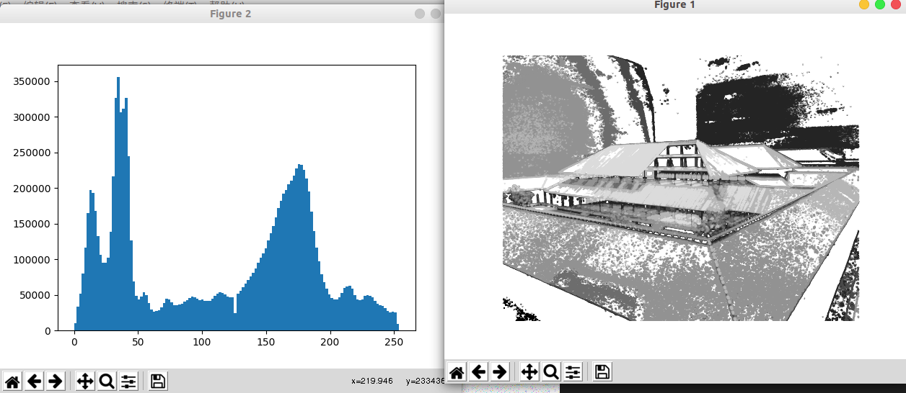

# 基本的图像操作和处理

## PIL python 图像处理类库

- PIL (python imageing library ) 
  - 提供了通用的图像处理功能
  - 以及大量有用的基本图像操作
    - 比如图像的
    - 缩放
    - 裁剪
    - 旋转
    - 颜色转换
    - 等等
- 从http://www.python.com/products/pil/下载


- 读取一副图像

```python
from PIL import Image
pil_im = Image.open('1234.jpg')
```


- 图像的`颜色转换` 使用 convert() 方法

```python
pil_im = Image.open('1234.jpg').convert('L')
```


- 更多例子参见 http://www.pythonware.com/library/pil/handbook/index.htm


### 转换图像格式


- 通过save方法，PIL可以将图像保存成多种格式的文件


```python
from PIL import Image
import os

filelist = []
filelist.append('1234.jpg')
for infile in filelist:
    outfile = os.path.splitext(infile)[0]+'.jpg'
    if infile != outfile:
        try:
            Image.open(infile).save(outfile)
		except IOError:
            print("outfile error")
```


- 除了后缀变成了 `jpg`  ，上述代码的新文件名和原文件名相同
- PIL函数会进行简单的检查，如果文件不是JPEG格式，会自动将其转换成JPEG格式
  - 如果转换失败，则会在控制台输出一个失败消息


### 获取目录中所有jpg图像的文件名列表

```python
from PIL import Image
import os

def get_imlist(path):
    return [os.path.join(path,f) for f in os.listdir(path) if f.endswith('jpg')]


print(get_imlist('./'))
```


### 创建缩略图

- 使用thumbnail()方法接受一个元祖参数（该参数指定生成缩略图的大小）

```python
pil_im.thumbnail((128,128))
```


### 复制和粘贴图像区域

- 使用crop()方法可以从一幅图像中裁剪指定区域

```python
from PIL import Image
import os

pil_im = Image.open('123.jpg')
print(pil_im)
pil_im = pil_im.crop((100,100,200,200))
pil_im.save(os.path.splitext('12345')[0] + '.jpg')
print(pil_im)
```


### 调整尺寸和旋转

- 使用resize() 方法 可以调整一幅图像的尺寸，该方法的参数是一个元祖，利用指新图像的大小
- 使用 rotate() 方法 可以使用逆时针方式 表示 旋转角度， 参数是角度


```python
from PIL import Image
import os

pil_im = Image.open('123.jpg')
print(pil_im)
pil_im = pil_im.resize((128,128))
print(pil_im)
pil_im.save(os.path.splitext('1234')[0] + '.jpg')

pil_im = pil_im.rotate(50)
print(pil_im)   
pil_im.save(os.path.splitext('12345')[0] + '.jpg')
```


## Matplotlib

- Matplotlib 是一个 处理数学运算，绘制图表，或者在图像上绘制 点，直线和曲线很好的类库

- 安装 matplotlib
  - python -m pip install matplotlib


### 绘制 图像，点和线

- Matplotlib 可以绘制出比较好的 条形图，饼状图，散点图等
- 但是，对于大多处计算机视觉应用来说，仅仅需要几个绘图命令


- 用画几个点和一条线


```python
from PIL import Image
from pylab import *

# 读取图像到数组中
im = array(Image.open('123.jpg'))
print(type(im))

# 绘制图像
imshow(im)

# 一些点
x = [100,100,400,400]
y = [200,500,200,500]

# 使用红色星状标记绘制点
plot(x, y, 'r*')

# 绘制连接前两个点的线
plot(x[:2], y[:2])

# 添加标题，显示绘制的图像
title('Plotting:"empire.jpg"')
show()
```


- 绘制的四个点 分别对应 (x[0], y[0])，(x[1],y[1])，(x[2],[y2])，(x[3],y[3])
- 连接的是数组中的 前两个 x[:2] 就是 x[0],x[1]，y同理
- show()命令首先打开图形用户界面（GUI），然后新建一个图像窗口，在每个脚本中仅能`调用一次`，而且一般在结尾调用
- 加上 `axis('off')` 可以不显示 x，y 轴

- 还有一些其他的命令


```python
plot(x, y) # 默认是蓝色实线
plot(x, y, 'r*') # 红色星状标记
plot(x, y, 'go-') # 带有圆圈标记的绿线
plot(x, y, 'ks:') # 带有正方形标记的褐色虚线
```


| 命令 | 颜色 |
| ---- | ---- |
| 'b'  | 蓝色 |
| 'g'  | 绿色 |
| 'r'  | 红色 |
| 'c'  | 青色 |
| 'm'  | 品红 |
| 'y'  | 黄色 |
| 'k'  | 黑色 |
| 'w'  | 白色 |


| 命令 | 线的形状 |
| ---- | -------- |
| '-'  | 实线     |
| '--' | 虚线     |
| ':'  | 点线     |


| 命令 | 点的形状 |
| ---- | -------- |
| '.'  | 点       |
| 'o'  | 圆圈     |
| 's'  | 正方形   |
| '*'  | 星形     |
| '+'  | 加号     |
| 'x'  | ×号      |


### 图像轮廓和直方图


- 因为绘制轮廓需要对每个坐标[x, y] 的像素值施加同一个阀值，所以需要将图像`灰度化` 即 convert('L') 
- 图像的直方图涌来表征该图像像素值的分布情况
  - 用一定数目的小区间（bin）来指定表征像素值的方位，每个小区间都会得到落入该小区间表示范围的像素数目
  - 该（灰度）图像的`直方图`可以使用`hist()`函数绘制
  - hits() 函数的第二个参数指定小区间的数目
  - hits()函数只接受一维数组作为输入，所以在绘制图像直方图之前，必须对图像进行压平处理
    - flatten()方法将任意数组按照优先准则转换成一维数组


```python
from PIL import Image
from pylab import *

# 读取图像到数组中
im = array(Image.open('12345.jpg').convert('L'))

# 新建一个图像
figure()

# 不使用颜色信息
gray()

# 在原点的左上角显示轮廓图像
contour(im, origin='image')
axis('equal')
axis('off')
figure()
hist(im.flatten(), 128)
show()
```





### 交互式标注

- 有时候用户需要和某些应用交互，例如在一副图像中标记一些点，或者标注一些训练数据
- PyLab库中的ginput() 函数就可以实现交互式标注
- 这里首先绘制图象，然后等待用户在绘图窗口区域点击三次
- 程序会自动将这些点击的坐标[x, y] 自动保存到 x 列表中


```python
from PIL import Image
from pylab import *

# 读取图像到数组中
im = array(Image.open('12345.jpg'))

imshow(im)
print('click 3 point')
x = ginput(3) # 标记点有三个
print('you clicked', x)
show()
```


## Numpy

- NumPy 是非常有名的Python科学计算工具包，包含大量有用的思想
  - 数组对象（用来表示向量，矩阵，图象等）
  - 线性代数等
- NumPy 中的 数组对象可以实现很多重要操作
  - 矩阵乘积
  - 转置
  - 解方程系统
  - 向量乘积
  - 归一化
- 为图形变形，对变化进行建模，图象分类，图象聚类等提供了基础


### 图象数组表示

- 先前的例子中 使用 `array()`方法将图象转换为NumPy 的数组对象
- NumPy中的数组对象是多维的，可以用来表示向量，矩阵和图象
- 一个数组对象很像一个列表(或者是列表的列表)，但是数组中所有元素必须具有相同的数据类型


**小例子**

```python
from PIL import Image
from pylab import *

# 读取图像到数组中
im = array(Image.open('12345.jpg'))

print(im.shape, im.dtype)

im = array(Image.open('12345.jpg').convert('L'), 'f')
print(im.shape, im.dtype)

```

- 输出为

```shell
(2976, 3968, 3) uint8
(2976, 3968) float32
```


- 每行的第一个元祖表示 图象数组的大小 (行，列，颜色通道)
- 紧接着的字符串表示数组元素的数据类型
  - 图象通道通常被编码为`无符号八位整数(uint8)`
  - 第二个因为进行过灰度处理，并且在创建数组时进行了额外的类型转换'f'，所以是float32(浮点型)


